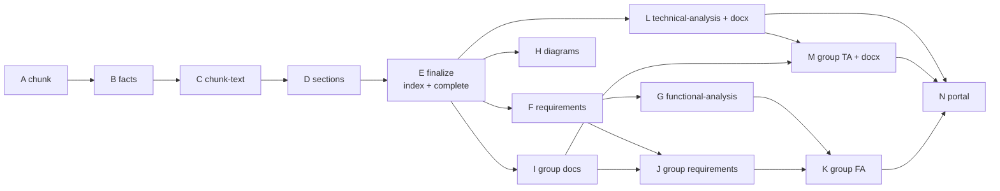
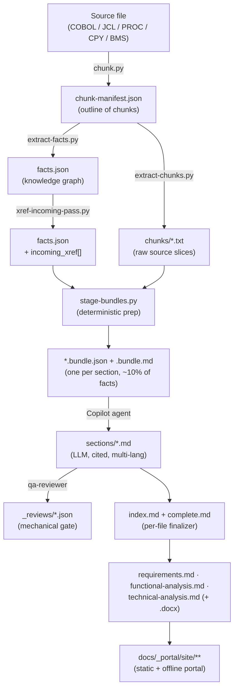
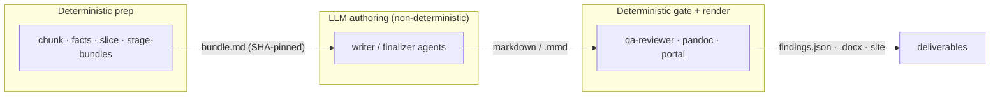
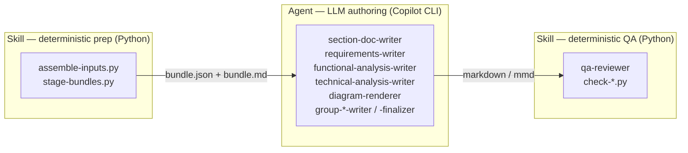

# Mainframe and IBM i Documentation Pipeline Sample


[](LICENSE)

> [!WARNING]
> **Sample proof of concept only.**
> This project is a sample PoC for generating COBOL documentation files and is not intended for
> production use.

An automated **reverse-engineering and documentation factory** for mainframe and IBM i sources
(COBOL, ILE COBOL, CL, JCL, PROC, copybook, BMS). It turns legacy source code into a complete,
multi-language documentation set — per-section docs, file landing pages, technical
requirements (ATE), functional analysis (AFU), technical analysis, overview diagrams,
group-level deliverables, and a browsable static portal.

The pipeline is built as a **DAG (directed acyclic graph) of phases**. Each phase is a
self-contained step that either runs a **deterministic Python skill** (parsing, slicing,
fact extraction) or dispatches a **GitHub Copilot agent** (LLM authoring) over prepared,
token-optimized input bundles. Native PowerShell and Bash orchestrators select phases, pass the
right parameters, run them in dependency order, retry failures, and stop on terminal errors.

---

## Quick start

Run these commands from the repository root. The deterministic workflows use bundled mainframe
and IBM i sources, so they work without editing configuration or supplying customer code.

### 1. Install dependencies

```console
python -m pip install --upgrade pip
python -m pip install pyyaml jsonschema markdown pymdown-extensions
```

Phases D–M additionally require an authenticated GitHub Copilot CLI. Install pandoc only
when Word (`.docx`) output is required.

Configure `source_root`, `include`, `exclude`, and `output.generate` in
`config/pipeline.yaml`. A run of the configured deliverables then requires no source arguments:

```powershell
pwsh -NoProfile -File scripts/run-pipeline.ps1
```

Use `-SourceRoot <folder>` for a temporary root override, or `-Paths <folder1>,<folder2>` with
`-SourceRoot <common-root>` to process selected folders recursively.

### 2. Run the mainframe deterministic smoke test

Windows PowerShell:

```powershell
pwsh -NoProfile -File scripts/run-pipeline.ps1 `
  -From A -To C `
  -Files repos/sample/COBOL/ORDR100.CBL `
  -SourceRoot repos/sample
```

Linux/macOS Bash:

```bash
bash scripts/run-pipeline.sh \
  -From A -To C \
  -Files repos/sample/COBOL/ORDR100.CBL \
  -SourceRoot repos/sample
```

This runs chunking, facts extraction, incoming cross-references, and raw text slicing without
LLM calls. Verify the main deterministic artifacts:

```text
docs/_shared/ORDR100.CBL/chunk-manifest.json
docs/_shared/ORDR100.CBL/facts.json
docs/_shared/ORDR100.CBL/chunks/index.json
```

### 3. Run the IBM i deterministic smoke test

The IBM i sample contains CLLE, CBLLE, SQLCBLLE, a copybook, DB2 for i SQL, and cross-program
calls. Its manifest selects exactly the five source members.

Windows PowerShell:

```powershell
pwsh -NoProfile -File scripts/run-pipeline.ps1 `
  -From A -To C `
  -Manifest repos/sample-as400/sources.json `
  -SourceRoot repos/sample-as400 `
  -ResultsDir temp/as400-sample
```

Linux/macOS Bash:

```bash
bash scripts/run-pipeline.sh \
  -From A -To C \
  -Manifest repos/sample-as400/sources.json \
  -SourceRoot repos/sample-as400 \
  -ResultsDir temp/as400-sample
```

See [the IBM i sample README](repos/sample-as400/README.md) for source layout, DB2 setup, and IBM i
compile commands.

### 4. Preview section authoring without LLM calls

Windows PowerShell:

```powershell
pwsh -NoProfile -File scripts/run-pipeline.ps1 `
  -Phases D `
  -Files repos/sample/COBOL/ORDR100.CBL `
  -SourceRoot repos/sample `
  -CopilotDocsDryRun
```

Linux/macOS Bash:

```bash
bash scripts/run-pipeline.sh \
  -Phases D \
  -Files repos/sample/COBOL/ORDR100.CBL \
  -SourceRoot repos/sample \
  -CopilotDocsDryRun
```

The dry run stages section bundles and prints the Copilot dispatch plan without consuming
model requests. Inspect bundles under `docs/_shared/ORDR100.CBL/_bundles/`.

### 5. Generate documentation for one source

After confirming Copilot CLI authentication, run the per-source documentation flow:

Windows PowerShell:

```powershell
pwsh -NoProfile -File scripts/run-pipeline.ps1 `
  -Files repos/sample/COBOL/ORDR100.CBL `
  -SourceRoot repos/sample `
  -Skip I,J,K,M,N `
  -Languages en,it `
  -MaxPhaseRetries 3
```

Linux/macOS Bash:

```bash
bash scripts/run-pipeline.sh \
  -Files repos/sample/COBOL/ORDR100.CBL \
  -SourceRoot repos/sample \
  -Skip I,J,K,M,N \
  -Languages en,it \
  -MaxPhaseRetries 3
```

The group phases are excluded because this command processes only one member. Generated
Markdown is written under `docs/en/ORDR100.CBL/` and `docs/it/ORDR100.CBL/`; shared bundles,
facts, diagrams, and reviews remain under `docs/_shared/ORDR100.CBL/`.

### 6. Process the bundled mainframe workspace

Run all configured sample programs, JCL, and PROC files to build the workspace portal. Group
phases are no-ops while `config/grouping.yaml` has no groups; declare groups there to produce
the group-level deliverables as part of the same command.

Windows PowerShell:

```powershell
$samplePaths = @(
  'repos/sample/COBOL/*.CBL'
  'repos/sample/JCL/*.JCL'
  'repos/sample/JCL/*.PRC'
)

& scripts/run-pipeline.ps1 `
  -Paths $samplePaths `
  -SourceRoot repos/sample `
  -Throttle 4 `
  -GroupLanguages en,it
```

Linux/macOS Bash:

```bash
bash scripts/run-pipeline.sh \
  -Paths 'repos/sample/COBOL/*.CBL' 'repos/sample/JCL/*.JCL' 'repos/sample/JCL/*.PRC' \
  -SourceRoot repos/sample \
  -Throttle 4 \
  -GroupLanguages en,it
```

---

## Table of Contents

- [Quick start](#quick-start)
- [Why this design](#why-this-design)
- [What you get — deliverables & output value](#what-you-get--deliverables--output-value)
- [Pipeline user documentation](#pipeline-user-documentation)
- [Key concepts](#key-concepts)
- [Architecture at a glance](#architecture-at-a-glance)
- [End-to-end data flow](#end-to-end-data-flow)
- [The hybrid approach: deterministic + LLM](#the-hybrid-approach-deterministic--llm)
- [Pipeline phases](#pipeline-phases)
- [Phase-by-phase detail](#phase-by-phase-detail)
- [Worked example: one COBOL program end-to-end](#worked-example-one-cobol-program-end-to-end)
- [How a phase actually runs](#how-a-phase-actually-runs)
- [Skills and agents: the two halves of every LLM phase](#skills-and-agents-the-two-halves-of-every-llm-phase)
- [The bundle pattern (token optimization)](#the-bundle-pattern-token-optimization)
- [Quality gates (qa-reviewer)](#quality-gates-qa-reviewer)
- [Profiles and templates](#profiles-and-templates)
- [Languages and co-authoring](#languages-and-co-authoring)
- [Grouping (workspace-scoped phases)](#grouping-workspace-scoped-phases)
- [Execution model](#execution-model)
- [Determinism, resume and idempotency](#determinism-resume-and-idempotency)
- [Configuration files](#configuration-files)
- [Prerequisites](#prerequisites)
- [Platform support](#platform-support)
- [Usage examples](#usage-examples)
- [Orchestrator options](#orchestrator-options)
- [Script organization and Linux support](#script-organization-and-linux-support)
- [Repository layout](#repository-layout)
- [CI samples: Azure DevOps and GitHub Actions](#ci-samples-azure-devops-and-github-actions)
- [Testing and verification](#testing-and-verification)
- [Glossary & acronyms](#glossary--acronyms)
- [See also](#see-also)
- [License](#license)

---

## Why this design

Documenting a 1,700+ artifact legacy application estate by hand is infeasible, and a naïve
"feed the whole program to an LLM" approach is both expensive and inaccurate. This
pipeline solves three problems at once:

1. **Accuracy** — the LLM never invents structure. Deterministic Python first parses the
   source into a precise outline (chunks) and a knowledge graph (facts: call-graph,
   PERFORM/GO TO targets, COPY references, EXEC SQL/CICS, JCL DD names, data records).
   The LLM only writes prose grounded in those facts, and every claim is cited back to
   source line ranges.
2. **Cost / context efficiency** — each LLM call reads ONE small, prepared *bundle*
   (~10% of the file's facts plus only the template and profile it needs) instead of the
   whole program. See [the bundle pattern](#the-bundle-pattern-token-optimization).
3. **Reproducibility** — phases A–C are byte-stable; every artifact is SHA-pinned to its
   inputs; runs are resumable; and a CI drift guard keeps the orchestrator and the DAG
   spec in sync.

---

## What you get — deliverables & output value

The pipeline replaces tribal knowledge and undocumented legacy code with a **traceable,
multi-language, audit-ready knowledge base**. For every source file (and every declared
group) it produces a consistent set of deliverables, each aimed at a specific audience.

### Per-source deliverables

| Deliverable | Phase | Audience | What it gives you |
|-------------|-------|----------|-------------------|
| `index.md` + `.docx` | E | Anyone navigating a program | Landing page: executive summary, navigable TOC, and call tables with inline Mermaid graphs for internal and cross-program edges. |
| `complete.md` + `.docx` | E | Maintainers, modernization teams | The full single-file reference for the program — every section concatenated, plus the deterministic `Record types (TRK)` catalog. Also the narrative source for the technical analysis. |
| `sections/*.md` | D | Developers tracing logic | Granular per-paragraph / per-section docs with a fully populated **cross-references** block (calls / called-by, data touched, file & DD bindings) and source-line citations. |
| `requirements.md` + `.docx` | F | Dev & modernization teams | Technical requirements extracted from the code, structured to the technical-requirements profile, with `REQ-NNN` / `NFR-NNN` IDs. |
| `functional-analysis.md` + `.docx` | G | Business analysts, functional owners | Functional analysis describing *what the program does* in business terms, structured to the functional-analysis profile. |
| `technical-analysis.md` + `.docx` | L | Formal delivery / sign-off | A complete technical analysis as Markdown **and** Word, ready for hand-off — the single-pass rewrite of `complete.md` into the formal template. |
| `diagrams/*.mmd` | D / H | Everyone | Visual comprehension: internal and inter-program call graphs, control flow, JCL/CL flow, CICS interactions, cursor lifecycle, and ER fragments. |

### Per-group deliverables

For each group in [config/grouping.yaml](config/grouping.yaml) the same `index.md`,
`complete.md`, `requirements.md`, `functional-analysis.md`, and `technical-analysis.md`
(with sibling `.docx` files when pandoc is available) are produced at **flow level**
(phases I/J/K/M), so a whole batch job or CICS
transaction can be understood as one unit rather than file-by-file.

### The portal (phase N)

All Markdown is compiled into a self-contained static **portal** with a language picker, a
side-by-side **source viewer**, clickable citations back to source lines, and client-side
Mermaid rendering. An **offline edition** inlines every resource so the whole knowledge base
is browsable directly from disk (`file://`) — no server, ideal for secure / air-gapped review.

## Pipeline user documentation

The tracked [site-docs/](site-docs/) tree is a separate user guide for this repository and its
DAG pipeline. GitHub Pages builds it from [mkdocs.yml](mkdocs.yml); it does not publish generated
phase-N output, depend on a pipeline run, or read `docs.zip`.

Preview the user guide locally:

```console
python -m pip install -r requirements-docs.txt
mkdocs serve
```

The [Pages workflow](.github/workflows/pages.yml) builds with `mkdocs build --strict --clean` and
deploys through the official GitHub Pages actions. In the repository settings, select
**Pages > Source > GitHub Actions**. See the
[CI and GitHub Actions guide](site-docs/guides/github-actions.md) for setup details.

### Why this is valuable

- **De-risks knowledge loss** — captures the behavior of code whose original authors have
  often retired, before a modernization or migration program begins.
- **Accelerates modernization** — the ATE/AFU deliverables and the facts graph feed directly
  into rewrite/migration planning (the config even carries `modernization` targets — Java /
  .NET, Spring Batch, PostgreSQL).
- **Audit-ready & verifiable** — every prose claim is cited to exact source line ranges and
  mechanically checked, so reviewers can trust and trace the documentation rather than
  re-reading the COBOL.
- **Requested languages only** — one language or several (for example EN + IT) are authored
  directly, with no mandatory English edition or translation intermediate.
- **Consistent & repeatable** — every program is documented to the same templates/profiles,
  so a 1,700-artifact estate reads uniformly and can be regenerated as the code evolves.

---

## Key concepts

| Concept | What it is |
|---------|-----------|
| **Phase** | One step of the DAG (A…N). Implemented by co-located `scripts/phases/phase-<id>-*.ps1` and `.sh` entry points. Each is standalone and fails fast (exit 4) when upstream artifacts are missing. |
| **Skill** | A reusable capability under [.github/skills/](.github/skills/), each with a `SKILL.md` and `scripts/`. Phases A–C are pure-Python skills; phases D–M pair a deterministic *prep* skill with an LLM *author* agent. |
| **Agent** | A Copilot agent definition under [.github/agents/](.github/agents/) (`*.agent.md`) that the LLM assumes for one authoring task. Agents are narrow, deterministic in behavior, and forbidden from reading anything beyond their bundle. |
| **Bundle** | A single prepared input file (`*.bundle.json` + a rendered `*.bundle.md`) staged deterministically for one LLM call. It embeds exactly the chunk/section, the relevant facts slice, the template, and the profile thresholds. |
| **Chunk** | A deterministic slice of a source: a division, section, paragraph, `EXEC SQL`/`EXEC CICS` block, data record, JCL job/step, PROC, mapset or map. |
| **Facts** | The per-file knowledge graph (`facts.json`): performs, go_tos, calls, copybooks, exec_sql, exec_cics, data_records, files, jcl_steps, bms_maps, plus `incoming_xref` (who calls me). |
| **Profile** | A YAML + template family that defines the section structure, front-matter and thresholds for a deliverable (requirements / functional-analysis / technical-analysis). Auto-selected per file by kind. |
| **Group** | A set of related members declared in [config/grouping.yaml](config/grouping.yaml) (e.g. a JCL job + the programs it calls + their copybooks). Phases I/J/K/M produce one deliverable per group. |

---

## Architecture at a glance

```
repos/<source-root>/**   →  A: chunk    →  docs/_shared/<file>/chunk-manifest.json
                            B: facts    →  docs/_shared/<file>/facts.json (+ workspace xref pass)
                            C: chunks   →  docs/_shared/<file>/chunks/*.txt
                            D: sections →  docs/<lang>/<file>/sections/*.md
                            E: finalize →  docs/<lang>/<file>/index.md + complete.md
                            F: REQ      →  docs/<lang>/<file>/requirements.md
                            G: FA       →  docs/<lang>/<file>/functional-analysis.md
                            H: diagrams →  docs/_shared/<file>/diagrams/*.mmd
                            I: group doc →  docs/<lang>/_groups/<group>/index.md + complete.md
                            J: group REQ →  docs/<lang>/_groups/<group>/requirements.md
                            K: group FA  →  docs/<lang>/_groups/<group>/functional-analysis.md
                            L: ATE      →  docs/<lang>/<file>/technical-analysis.md + .docx
                            M: group ATE →  docs/<lang>/_groups/<group>/technical-analysis.md + .docx
                            N: portal   →  docs/_portal/site/** (+ offline edition)
```

- **Phases A–C** are deterministic Python (no LLM): parse → extract facts → slice text.
- **Phases D–M** are LLM-driven via the skills + agents under [.github/skills/](.github/skills/)
  and [.github/agents/](.github/agents/). Phases L/M add a deterministic **pandoc** step to emit `.docx`.
- **Phases I/J/K/M** are *workspace-scoped*: they fan in over the groups declared in
  [config/grouping.yaml](config/grouping.yaml). With no groups declared they are no-ops (exit 0).
- **Phase N** builds the static portal (web edition) plus an offline `file://`-browsable edition.

### DAG dependencies



> **Two phase views are intentional.** The executable runner exposes the fine-grained
> A–N order from `$script:PhaseScriptMap` in
> [scripts/lib/Resolve-PhaseInputs.ps1](scripts/lib/Resolve-PhaseInputs.ps1). The logical DAG in
> [config/pipeline-dag.yaml](config/pipeline-dag.yaml) is coarser: logical B maps to runner B+C,
> and logical C maps to runner D+E+H. The authoritative reconciliation is `DAG_TO_ORCH` in
> [scripts/validation/check-phase-order.py](scripts/validation/check-phase-order.py). CI rejects unmapped, duplicated,
> out-of-order, cyclic, or stale phase declarations.

### Logical DAG versus executable phases

| Logical DAG phase | Executable phase script(s) | Combined responsibility |
|-------------------|----------------------------|-------------------------|
| A | A | Chunking |
| B | B, C | Facts extraction, workspace incoming-xref, raw chunk text |
| C | D, E, H | Section authoring and QA, per-file finalization, overview diagrams |
| F, G | F, G | Requirements and functional analysis |
| I, J, K | I, J, K | Group documentation, requirements, and functional analysis |
| L, M | L, M | Per-file and per-group technical analysis |
| N | N | Static and offline portal |

All commands in this README use the **executable** phase ids. For example, `-To C` runs only
the deterministic runner phases A–C; section authoring starts at runner phase D. The YAML DAG
uses its logical ids for dependency and scope modelling.

---

## End-to-end data flow



---

## The hybrid approach: deterministic + LLM

The pipeline is deliberately **hybrid**: it combines a *deterministic* engine (Python +
PowerShell, no model) with a *non-deterministic* engine (LLM authoring via the Copilot CLI).
The two never overlap responsibilities — each phase belongs to exactly one engine class, and
the handoff between them is a single, SHA-pinned artifact.

### Two engine classes

| | **Deterministic** (Python / PowerShell) | **Non-deterministic** (LLM agents) |
|---|---|---|
| **Phases** | A, B, C, N, and the *prep* + *QA* + *DOCX* halves of D–M | The *authoring* half of D, E, F, G, H, I, J, K, L, M |
| **Job** | Parse, slice, build the facts graph, stage bundles, lint output, render `.docx`, build the portal | Turn facts into grounded prose: section docs, requirements, functional/technical analysis, diagrams |
| **Properties** | Byte-stable, repeatable, schema-validated, SHA-fingerprinted, no network | Creative, judgement-based, language-aware; constrained to read one bundle and write fixed paths |
| **Failure mode** | Hard exit codes (`3` schema, `4` missing/stale input) | Mechanically caught by `qa-reviewer`; re-runnable via `-Force` |

### Why split it this way

- **Structure is a fact, not an opinion.** Where a paragraph starts, which programs a JCL
  step calls, which copybook a record comes from — these are extracted exactly by regex /
  line scanning, so the LLM is never asked to *discover* structure, only to *describe* it.
- **The LLM stays grounded.** Every authoring call receives a prepared bundle containing the
  relevant facts slice and the source text, and is forbidden from reading anything else. Every
  claim it writes must cite a source line range (`[^src-N]` footnotes). Mechanical checks then
  verify the citations exist.
- **Non-determinism is contained, not eliminated.** LLM output naturally varies between runs.
  The pipeline absorbs that by: (1) pinning the *inputs* (template/profile/slice SHAs in each
  bundle), (2) gating the *outputs* with the deterministic `qa-reviewer`, and (3) making
  re-runs cheap and idempotent (resume skips up-to-date units; `-Force` re-authors).

### The deterministic ⇄ LLM boundary



Everything to the left of the bundle and to the right of the markdown is reproducible; only
the middle box is generative. That single boundary is what makes a 1,700+ artifact estate
tractable, auditable, and affordable.

---

## Pipeline phases

| Phase | Scope | Engine | Purpose | Primary output | Phase script | Batch wrapper |
|-------|-------|--------|---------|----------------|--------------|---------------|
| **A** | per-file | Python | Chunk source into divisions/sections/paragraphs/EXEC SQL/CICS/records/jobs/steps/maps | `docs/_shared/<file>/chunk-manifest.json` | [phase-A-chunk.ps1](scripts/phases/phase-A-chunk.ps1) | [chunk_batch.ps1](.github/skills/cobol-chunking/scripts/chunk_batch.ps1) |
| **B** | per-file + workspace | Python | Extract facts (PERFORM/GO TO, COPY, EXEC SQL/CICS, JCL DD, call-graph) + workspace incoming-xref pass | `docs/_shared/<file>/facts.json` | [phase-B-facts.ps1](scripts/phases/phase-B-facts.ps1) | [extract_facts_batch.ps1](.github/skills/cobol-facts-extraction/scripts/extract_facts_batch.ps1) |
| **C** | per-file | Python | Slice raw text per chunk for downstream prompts | `docs/_shared/<file>/chunks/*.txt` | [phase-C-extract-text.ps1](scripts/phases/phase-C-extract-text.ps1) | [extract_chunks_batch.ps1](.github/skills/chunk-text-extraction/scripts/extract_chunks_batch.ps1) |
| **D** | per-section | LLM | Author per-section docs (Copilot CLI) | `docs/<lang>/<file>/sections/*.md` | [phase-D-section-docs.ps1](scripts/phases/phase-D-section-docs.ps1) | [run-docs-copilot-batch.ps1](scripts/dispatchers/run-docs-copilot-batch.ps1) |
| **E** | per-file | LLM + Python | Stage finalize bundle, write `index.md` + `complete.md`, append the deterministic record-layout catalog, export DOCX | `docs/<lang>/<file>/{index,complete}.{md,docx}` | [phase-E-finalize.ps1](scripts/phases/phase-E-finalize.ps1) | [finalize_stage_batch.ps1](.github/skills/section-doc-finalizer/scripts/finalize_stage_batch.ps1) + [run-docs-finalize-batch.ps1](scripts/dispatchers/run-docs-finalize-batch.ps1) |
| **F** | per-section | LLM + Python | Stage requirements bundles, author and QA per-section drafts, stitch `requirements.md`, export DOCX | `docs/<lang>/<file>/requirements.{md,docx}` | [phase-F-requirements.ps1](scripts/phases/phase-F-requirements.ps1) | [req_stage_batch.ps1](.github/skills/requirements-writer/scripts/req_stage_batch.ps1) + section/finalizer dispatchers |
| **G** | per-section | LLM + Python | Stage FA bundles, author and QA per-section drafts, stitch `functional-analysis.md`, export DOCX | `docs/<lang>/<file>/functional-analysis.{md,docx}` | [phase-G-functional-analysis.ps1](scripts/phases/phase-G-functional-analysis.ps1) | [fa_stage_batch.ps1](.github/skills/functional-analysis-writer/scripts/fa_stage_batch.ps1) + section/finalizer dispatchers |
| **H** | per-file | LLM | Author file-level overview diagrams (`.mmd`) | `docs/_shared/<file>/diagrams/*.mmd` | [phase-H-diagrams.ps1](scripts/phases/phase-H-diagrams.ps1) | [run-docs-diagrams-batch.ps1](scripts/dispatchers/run-docs-diagrams-batch.ps1) |
| **I** | per-group | LLM + Python | Author per-group `index.md` + `complete.md`, export DOCX | `docs/<lang>/_groups/<group>/{index,complete}.{md,docx}` | [phase-I-group-docs.ps1](scripts/phases/phase-I-group-docs.ps1) | [run-docs-group-doc-finalize-batch.ps1](scripts/dispatchers/run-docs-group-doc-finalize-batch.ps1) |
| **J** | per-group | LLM + Python | Stage group requirements bundles, author drafts, stitch `requirements.md`, export DOCX | `docs/<lang>/_groups/<group>/requirements.{md,docx}` | [phase-J-group-requirements.ps1](scripts/phases/phase-J-group-requirements.ps1) | section/finalizer dispatchers |
| **K** | per-group | LLM + Python | Stage group FA bundles, author drafts, stitch `functional-analysis.md`, export DOCX | `docs/<lang>/_groups/<group>/functional-analysis.{md,docx}` | [phase-K-group-functional-analysis.ps1](scripts/phases/phase-K-group-functional-analysis.ps1) | section/finalizer dispatchers |
| **L** | per-file | LLM + pandoc | Stage TA bundle from `complete.md`, single-pass author technical-analysis (ATE), export `.docx` | `docs/<lang>/<file>/technical-analysis.md` + `.docx` | [phase-L-technical-analysis.ps1](scripts/phases/phase-L-technical-analysis.ps1) | [ta_stage_batch.ps1](.github/skills/technical-analysis-writer/scripts/ta_stage_batch.ps1) + [run-docs-ta-finalize-batch.ps1](scripts/dispatchers/run-docs-ta-finalize-batch.ps1) |
| **M** | per-group | LLM + pandoc | Stage group TA bundle, single-pass author per-group technical-analysis (ATE), export `.docx` | `docs/<lang>/_groups/<group>/technical-analysis.md` + `.docx` | [phase-M-group-technical-analysis.ps1](scripts/phases/phase-M-group-technical-analysis.ps1) | [ta_group_stage_batch.ps1](.github/skills/technical-analysis-writer/scripts/ta_group_stage_batch.ps1) + [run-docs-ta-group-finalize-batch.ps1](scripts/dispatchers/run-docs-ta-group-finalize-batch.ps1) |
| **N** | workspace | Python | Build static portal (web + offline editions) | `docs/_portal/site/**` | [phase-N-portal.ps1](scripts/phases/phase-N-portal.ps1) | [build-portal-static.py](scripts/portal/build-portal-static.py) / [build-portal-offline.py](scripts/portal/build-portal-offline.py) |

---

## Phase-by-phase detail

Each phase below lists its **engine**, **inputs**, **what it does**, **outputs**, and the
**determinism / failure** behavior. Deterministic phases re-run to byte-identical output;
LLM phases vary but are gated and resumable.

### Phase A — Chunking · _deterministic (Python)_

- **Skill:** [cobol-chunking](.github/skills/cobol-chunking/) · `chunk.py`
- **Input:** one source file (COBOL / JCL / PROC / copybook / BMS).
- **Does:** detects encoding (UTF-8 / cp1047 EBCDIC / latin-1) and source kind, then scans the
  source with regex / column rules to build a hierarchical outline. It honours fixed-format
  COBOL areas (headers only recognised in Area A, columns 8–11), never treats comment/debug
  (`*`/`/`/`D`/`$`) or continuation (`-`) lines as headers, and emits `EXEC SQL`/`EXEC CICS`
  blocks as atomic chunks nested under their enclosing paragraph.
- **Output:** `docs/_shared/<file>/chunk-manifest.json` — `{manifest_version, source_path,
  source_kind, encoding_detected, sha256, line_count, chunks[], errors[]}`. Chunk `kind`s
  vary by source kind (e.g. COBOL → `division`/`section`/`paragraph`/`exec-sql`/`exec-cics`/
  `data-record`; JCL → `jcl-job`/`jcl-step`/`jcl-proc`; BMS → `bms-mapset`/`bms-map`/`bms-field`).
  Each chunk `id` is a slash path (e.g. `PROG1/procedure-division/MAIN/A000-MAIN`).
- **Determinism / failure:** no LLM; byte-identical on unchanged input (stable key order, raw-byte
  `sha256`). Self-validates against `scripts/schemas/chunks.schema.json`; schema failure → **exit 3**,
  no file written.

### Phase B — Facts extraction (+ workspace xref) · _deterministic (Python)_

- **Skill:** [cobol-facts-extraction](.github/skills/cobol-facts-extraction/) · `extract-facts.py`, `xref-incoming-pass.py`
- **Input:** the source file + its phase-A `chunk-manifest.json`.
- **Does:** builds the per-file **knowledge graph** by scanning each chunk: `paragraphs`
  (call-graph nodes), `performs`, `go_tos`, `calls` (CALL / CICS LINK / CICS XCTL, with a
  `dynamic` flag), `copybooks` (with `REPLACING`), `exec_sql` (verb / tables / cursors /
  host-vars), `exec_cics` (command / args), `data_records` (01-levels with picture / usage /
  redefines / occurs), `files` (SELECT+FD merge), `jcl_steps` (program / proc / DD list), and
  `bms_maps`. Every entry carries the `chunk_id` join key used by phase-C slicing.
- **Workspace pass:** after every file's facts exist, `xref-incoming-pass.py` runs **once**
  across `docs/_shared/**/facts.json`, builds the inverted caller map (CALL / CICS LINK·XCTL /
  COPY / JCL `EXEC PGM=`) and rewrites each file's `incoming_xref[]` (who calls me) plus
  `jcl_steps[].resolved_source`. This is the deferred `workspace`-scope step embedded in phase B.
- **Output:** `docs/_shared/<file>/facts.json` (with `manifest_sha256` + `source_sha256`).
- **Determinism / failure:** no LLM; schema-validated (**exit 3** on failure). The xref pass is
  single-shot, not parallelizable, and byte-stable on no upstream change.

### Phase C — Per-chunk text slices · _deterministic (Python)_

- **Skills:** [chunk-text-extraction](.github/skills/chunk-text-extraction/) · `extract-chunks.py`; [facts-slicing](.github/skills/facts-slicing/) · `slice-facts.py`
- **Input:** the source file + `chunk-manifest.json` (+ `facts.json` for slicing).
- **Does:** writes one raw-text file per chunk (`chunks/<chunk_id>.txt` + `index.json`) and fans
  `facts.json` into per-chunk **facts-slices** (~10% of the file each). These are the inputs the
  bundle stager consumes so each later LLM call sees only its slice, never the whole file.
- **Output:** `docs/_shared/<file>/chunks/*.txt` (+ `index.json`) and per-chunk facts-slices.
- **Determinism / failure:** no LLM; SHA-gated against the phase-A manifest — **exit 4 (STALE)**
  if the source changed under it.

### Phase D — Section docs · _hybrid (deterministic prep + LLM author + deterministic QA)_

- **Skills/agent:** [section-doc-writer](.github/skills/section-doc-writer/) skill + `section-doc-writer` agent; gated by [qa-reviewer](.github/skills/qa-reviewer/).
- **Prep (deterministic):** `stage-bundles.py` → `assemble-inputs.py` builds one
  `_bundles/<chunk_id>.bundle.json` + rendered `.bundle.md` per chunk, embedding the chunk
  record, its source text, its facts slice, the kind-matching template link, profile thresholds,
  and the authoritative output paths.
- **Author (LLM):** for each chunk the agent reads **only** the bundle MD and co-authors
  `docs/<lang>/<file>/sections/<chunk_id>.md` for exactly the requested languages, plus the
  per-section `docs/_shared/<file>/diagrams/section-<chunk_id>.mmd`. Templates are selected by
  chunk kind (paragraph/section, division, data-record, JCL, …). Output must follow the
  template, cite via `[^src-N]` footnotes, backtick identifiers, and fully populate the
  `## Cross-references` block from the bundle (calls/used-by, data touched, file/DD bindings).
- **QA (deterministic):** `check-section-doc.py` lints each markdown → `docs/_reviews/section-doc/…json`.
- **Determinism / failure:** prep + QA are byte-stable; authoring varies but is constrained and
  re-runnable. Dispatched via [run-docs-copilot-batch.ps1](scripts/dispatchers/run-docs-copilot-batch.ps1)
  with state/plan files for resume.

### Phase E — Per-file finalize (`index.md` + `complete.md`) · _hybrid_

- **Skill/agent:** [section-doc-finalizer](.github/skills/section-doc-finalizer/) + `section-doc-finalizer` agent.
- **Prep (deterministic):** stages a `_finalize.bundle.json` from the per-section MD set +
  manifest/facts TOC fields.
- **Author (LLM):** composes the navigable `index.md` with its TOC, executive summary,
  internal-call table (`PERFORM` / `GO TO`), and cross-program call table (inbound and
  outbound COBOL, CICS, CL, and JCL edges). Each non-empty table is followed by an inline
  Mermaid graph. The same content enters `complete.md` through deterministic concatenation.
- **TRK catalog (deterministic):** `assemble-complete.py` appends a record-layout catalog
  to `complete.md` derived from fixed-layout `data_records` — the single point where that
  catalog enters the pipeline so phase L can author its record-layout section without re-reading FA.
- **Output:** `docs/<lang>/<file>/{index,complete}.md`.

### Phase F — Technical requirements (ATE) · _hybrid (per-section fan-out + finalizer)_

- **Skills/agent:** [requirements-writer](.github/skills/requirements-writer/) / [requirements-finalizer](.github/skills/requirements-finalizer/) + `requirements-writer` agent.
- **Profile (deterministic):** `req_profile_resolver.py` picks the `default` profile, an
  *application* profile, or an *interface* profile per file by kind; copybooks/BMS are
  **skipped** with a `_skipped.json` tombstone.
- **Author (LLM):** for each profile section, co-authors a per-language draft under
  `_req-sections/<lang>/<section_id>.md` (each from its own bundle), then a finalizer stitches
  the drafts in profile order into `requirements.md`, filling front-matter and stamping optional
  sections that were skipped.
- **QA (deterministic):** `check-requirements.py` per section and per file.

### Phase G — Functional analysis (AFU) · _hybrid (per-FA-section fan-out + finalizer)_

- **Skills/agent:** [functional-analysis-writer](.github/skills/functional-analysis-writer/) / [functional-analysis-finalizer](.github/skills/functional-analysis-finalizer/) + agent.
- **Profile (deterministic):** `fa_profile_resolver.py` picks the `default` profile, an
  *application* profile, or an *interface* profile; copybooks/BMS skipped (tombstone).
- **Author (LLM):** mirrors phase F — per-section drafts under `_fa-sections/<lang>/…` then a
  finalizer stitches `functional-analysis.md` per language. FA sections may cite the requirement
  IDs produced in phase F.
- **QA (deterministic):** `check-functional-analysis.py`.

### Phase H — File-level overview diagrams · _hybrid (deterministic prep + LLM author)_

- **Skill/agent:** [diagram-renderer](.github/skills/diagram-renderer/) + `diagram-renderer` agent.
- **Author (LLM):** from a `_diagrams.bundle.json` (projection of `facts.json`) authors one
  `.mmd` per non-empty fact collection: `call-graph` (calls inside one program),
  `inter-program-call-graph` (inbound and outbound calls between programs), `control-flow`,
  `jcl-steps`, `cl-command-flow`, `cics-calls`, `cursor-lifecycle`, and `er-fragment`.
  Per-section `.mmd` files belong to phase D, not here.
- **Output:** `docs/_shared/<file>/diagrams/*.mmd` (language-neutral, so no `-Languages`).

### Phase I — Group documentation · _hybrid, workspace-scoped_

- **Skill/agent:** [group-doc-finalizer](.github/skills/group-doc-finalizer/) + agent.
- **Author (LLM):** for each group in [config/grouping.yaml](config/grouping.yaml), stitches the
  members' phase-E outputs into a group `index.md` + `complete.md`. No groups → no-op (exit 0).

### Phase J — Group technical requirements · _hybrid, workspace-scoped_

- **Skill/agent:** [requirements-group-writer](.github/skills/requirements-group-writer/) / [requirements-group-finalizer](.github/skills/requirements-group-finalizer/) + agent.
- **Author (LLM):** group-scope mirror of phase F (reusing the requirements profile family);
  depends on F (per-member ATE) and I (group `complete.md` text source). PRC-only groups skip.

### Phase K — Group functional analysis · _hybrid, workspace-scoped_

- **Skill/agent:** [functional-analysis-group-writer](.github/skills/functional-analysis-group-writer/) / [functional-analysis-group-finalizer](.github/skills/functional-analysis-group-finalizer/) + agent.
- **Author (LLM):** group-scope mirror of phase G; depends on G and J (so AFU can cite group ATE IDs).

### Phase L — Technical analysis (ATE) + DOCX · _hybrid, single-pass_

- **Skill/agent:** [technical-analysis-writer](.github/skills/technical-analysis-writer/) + agent.
- **Single-pass (no per-section drafts):** the first requested language's consolidated `docs/<lang>/<file>/complete.md` is the
  **only** narrative input (never `functional-analysis.md`). `ta_profile_resolver.py` resolves the
  profile (the `default`, *application*, or *interface* profile; copybooks/BMS skip).
- **Author (LLM):** reorganizes `complete.md` into the TA template structure, co-authoring
  `technical-analysis.md` per language; the `trk-gestiti` section is authored from the
  deterministic TRK catalog phase E appended to `complete.md`.
- **DOCX (deterministic):** `Convert-MdToDocx.ps1` renders a sibling `technical-analysis.docx`
  via pandoc; skipped with a warning if pandoc is absent.

### Phase M — Group technical analysis + DOCX · _hybrid, workspace-scoped, single-pass_

- **Skill/agent:** [technical-analysis-writer](.github/skills/technical-analysis-writer/) (per-group scope) + agent.
- **Does:** the group-scope mirror of phase L from the group `complete.md`, plus the pandoc DOCX step.

### Phase N — Documentation portal · _deterministic (Python)_

- **Scripts:** [build-portal-static.py](scripts/portal/build-portal-static.py) (web) + [build-portal-offline.py](scripts/portal/build-portal-offline.py) (offline).
- **Does:** converts every generated Markdown deliverable into a self-contained static HTML
  portal (python-markdown, no MkDocs — fast enough for 1,700+ pages), with a language picker,
  per-page source viewer, citation links and client-side Mermaid rendering. The offline builder
  inlines fetched resources so the site is browsable directly from disk (`file://`).
- **Output:** `docs/_portal/site/**` and `docs/_portal/site-offline/**`.

---

## Worked example: one COBOL program end-to-end

Following an example program `repos/<source-root>/COBOL/PROG1.CBL` through the pipeline
(`<source-root>` is the directory configured in [config/pipeline.yaml](config/pipeline.yaml)):

```powershell
pwsh -NoProfile -File scripts/run-pipeline.ps1 -Files repos/<source-root>/COBOL/PROG1.CBL `
     -RequirementsLanguages en,it -FunctionalAnalysisLanguages en,it -TechnicalAnalysisLanguages en,it
```

| Step | Engine | Produces (for `PROG1.CBL`) |
|------|--------|------------------------------|
| A | deterministic | `docs/_shared/PROG1.CBL/chunk-manifest.json` — the outline: divisions, paragraphs, `EXEC SQL`/`CICS` blocks, 01-level records. |
| B | deterministic | `docs/_shared/PROG1.CBL/facts.json` — performs/calls/copybooks/files/data_records; then the workspace pass fills `incoming_xref[]` (e.g. the JCL step that runs it). |
| C | deterministic | `docs/_shared/PROG1.CBL/chunks/*.txt` + per-chunk facts slices. |
| D | hybrid | `docs/en/PROG1.CBL/sections/*.md` (+ `it/…`) — one doc per paragraph/section, plus `docs/_shared/PROG1.CBL/diagrams/section-*.mmd`. Gated by `qa-reviewer`. |
| E | hybrid | `docs/en/PROG1.CBL/index.md` + `complete.md` (+ `it/…`), including internal and cross-program call tables. |
| F | hybrid | `docs/en/PROG1.CBL/requirements.md` (+ `it/…`) — technical requirements. |
| G | hybrid | `docs/en/PROG1.CBL/functional-analysis.md` (+ `it/…`) — functional analysis. |
| H | hybrid | `docs/_shared/PROG1.CBL/diagrams/{call-graph,inter-program-call-graph,...}.mmd`. |
| L | hybrid | `docs/en/PROG1.CBL/technical-analysis.md` + `.docx` (+ `it/…`). |
| N | deterministic | `docs/_portal/site/en/PROG1.CBL/…` rendered into the browsable portal. |

If `PROG1.CBL` is also a member of a group declared in
[config/grouping.yaml](config/grouping.yaml), the workspace phases (I/J/K/M) additionally fold
it into the group deliverables under `docs/<lang>/_groups/<group_id>/…`, documenting the whole
batch flow (a JCL job → PROC → the COBOL programs it calls) as one unit.

To inspect intermediates without spending LLM calls, run `-From A -To C` (pure deterministic),
or add a `-DryRun` flag to any LLM phase to stage bundles only.

---

## How a phase actually runs

Every phase script under [scripts/phases/](scripts/phases/) dot-sources the shared helper
[scripts/lib/Resolve-PhaseInputs.ps1](scripts/lib/Resolve-PhaseInputs.ps1) and follows the
same lifecycle:

1. **Resolve repo root** and expand `-Files` / `-Paths` / `-Manifest` into a source list
   (`Get-PhaseInputs`).
2. **Assert prerequisites** — verify the upstream artifacts each source needs exist
   (`Assert-PhasePrereqs`). Missing inputs cause an immediate **exit 4** that lists every
   absent file, so failures are diagnosable without reading logs.
3. **Run the phase's batch action** with timing and a per-run XML tally
   (`Invoke-PhaseBatch`). Deterministic phases shell out to the Python skill batch wrappers;
   LLM phases dispatch the Copilot CLI via a runspace pool (PowerShell 5.1- and 7-compatible).
4. **Retry failed phases** up to three times by default. Both non-zero exit codes and
  terminating PowerShell errors trigger a retry. Set `-MaxPhaseRetries <n>` on
  `run-pipeline.ps1`; use `0` to disable retries. After exhaustion, the pipeline stops and
  returns the final phase exit code.
5. **Emit structured events** and stamp a stable, UTC-named copy of the results
   XML:

```
[phase=A event=end ok=1 elapsed=10.72s state=success failed=0 exit=0]
PHASE-DONE phase=A ok=1 failed=0 elapsed=10.72s exit=0 state=success
```

A failed attempt that will be retried also emits a machine-readable event:

```
[phase=D event=retry attempt=1 exit=1 max_retries=3 next_attempt=2]
```

```
chunk_results.20260529T101530Z.xml      # UTC-stamped sibling for the run
chunk_results.xml                        # latest (overwritten each run)
```

The orchestrator [scripts/run-pipeline.ps1](scripts/run-pipeline.ps1) is intentionally
"skinny": it only selects the phase subset, splats the shared + phase-specific args from a
data-driven `$phasePlan` table, invokes each phase script in order, and stops on the first
non-zero exit code. Adding a phase means adding a row to that table and to the phase map —
no special-casing.

---

## Skills and agents: the two halves of every LLM phase

Each LLM phase is split into a **deterministic half** (a *skill*'s Python `scripts/`) and an
**authoring half** (a Copilot *agent*). This separation is the heart of the design.



- **Deterministic prep** ([section-doc-writer](.github/skills/section-doc-writer/),
  [requirements-writer](.github/skills/requirements-writer/),
  [functional-analysis-writer](.github/skills/functional-analysis-writer/),
  [technical-analysis-writer](.github/skills/technical-analysis-writer/),
  [diagram-renderer](.github/skills/diagram-renderer/), and the group variants)
  produces the bundle and computes the authoritative output paths. No LLM involved.
- **LLM authoring** is performed by the matching agent under [.github/agents/](.github/agents/).
  Agents are deliberately constrained: they may read **only** their bundle MD and write
  **only** the declared output paths; re-reading `facts.json`, `chunk-manifest.json`,
  chunks, slices or the raw `.bundle.json` is **forbidden** (the MD already embeds
  everything). Each agent ends with one terse `DONE …` line — no narration.
- **Deterministic QA** ([qa-reviewer](.github/skills/qa-reviewer/)) mechanically lints the
  produced markdown and writes a `findings[]` JSON sidecar under `docs/_reviews/`.

### Skill inventory

| Skill | Phase | Role |
|-------|-------|------|
| [cobol-chunking](.github/skills/cobol-chunking/) | A | Deterministic chunker → `chunk-manifest.json` |
| [cobol-facts-extraction](.github/skills/cobol-facts-extraction/) | B | Deterministic facts graph + workspace incoming-xref pass |
| [chunk-text-extraction](.github/skills/chunk-text-extraction/) | C | Per-chunk raw text slices |
| [facts-slicing](.github/skills/facts-slicing/) | C/D | Fan `facts.json` into per-chunk slices (~10% each) |
| [section-doc-writer](.github/skills/section-doc-writer/) | D | Per-section doc prep + author |
| [section-doc-finalizer](.github/skills/section-doc-finalizer/) | E | File-level `index.md` + `complete.md` |
| [requirements-writer](.github/skills/requirements-writer/) / [requirements-finalizer](.github/skills/requirements-finalizer/) | F | Technical requirements (ATE) |
| [functional-analysis-writer](.github/skills/functional-analysis-writer/) / [functional-analysis-finalizer](.github/skills/functional-analysis-finalizer/) | G | Functional analysis (AFU) |
| [diagram-renderer](.github/skills/diagram-renderer/) | H | File-level overview `.mmd` diagrams |
| [group-doc-finalizer](.github/skills/group-doc-finalizer/) | I | Per-group landing page + concatenation |
| [requirements-group-writer](.github/skills/requirements-group-writer/) / [requirements-group-finalizer](.github/skills/requirements-group-finalizer/) | J | Group requirements |
| [functional-analysis-group-writer](.github/skills/functional-analysis-group-writer/) / [functional-analysis-group-finalizer](.github/skills/functional-analysis-group-finalizer/) | K | Group functional analysis |
| [technical-analysis-writer](.github/skills/technical-analysis-writer/) | L/M | Technical analysis (ATE) per-file + per-group |
| [qa-reviewer](.github/skills/qa-reviewer/) | C–M | Deterministic markdown linter / gate |

### Custom Copilot agents

Each LLM phase is performed by a dedicated agent under [.github/agents/](.github/agents/).
All authoring agents share the same hard contract: **read only the prepared bundle MD, write
only the declared output paths, never re-read `facts.json` / `chunk-manifest.json` / chunks /
slices, and finish with one terse `DONE …` line** (no narration). Agent front matter is the
source of truth for model routing: authoring agents currently use `Auto (copilot)`, while the
lightweight section reviewer uses `MAI-Code-1-Flash (copilot)`. Multi-language writers
author exactly the requested languages in a single call.

| Agent | Phase | Scope | Model | What it does |
|-------|-------|-------|-------|--------------|
| [section-doc-writer](.github/agents/section-doc-writer.agent.md) | D | per-section | Auto | Authors one `sections/<chunk_id>.md` per language + the per-section `.mmd` for exactly one chunk, fully populating the cross-references block from the bundle. |
| [section-doc-finalizer](.github/agents/section-doc-finalizer.agent.md) | E | per-file | Auto | Authors the file-level `index.md`, including internal and cross-program call tables. `complete.md` is assembled by a deterministic post-step. |
| [requirements-writer](.github/agents/requirements-writer.agent.md) | F | per-section + per-file finalizer | Auto | Authors technical-requirements section drafts, then stitches them into `requirements.md`. Scope comes from the bundle's `scope` field. |
| [functional-analysis-writer](.github/agents/functional-analysis-writer.agent.md) | G | per-section + per-file finalizer | Auto | Authors functional-analysis section drafts, then stitches them into `functional-analysis.md`. |
| [diagram-renderer](.github/agents/diagram-renderer.agent.md) | H | per-file | Auto | Authors file-level Mermaid sources, including internal and inter-program call graphs, one `.mmd` per non-empty facts collection. |
| [group-doc-finalizer](.github/agents/group-doc-finalizer.agent.md) | I | per-group | Auto | Stitches member phase-E outputs into a per-group `index.md` + `complete.md`, one group per call. |
| [requirements-group-writer](.github/agents/requirements-group-writer.agent.md) | J | per-section + per-group finalizer | Auto | Group-scope ATE: section drafts + per-group `requirements.md`. |
| [functional-analysis-group-writer](.github/agents/functional-analysis-group-writer.agent.md) | K | per-section + per-group finalizer | Auto | Group-scope AFU: section drafts + per-group `functional-analysis.md`. |
| [technical-analysis-writer](.github/agents/technical-analysis-writer.agent.md) | L / M | per-file + per-group | Auto | Single-pass technical analysis: reorganizes `complete.md` into the technical-analysis template, per file (L) or per group (M). DOCX is rendered deterministically afterwards. |

**Optional write→review loop (phase D variant).** Instead of the single-shot
`section-doc-writer`, a chunk can be driven through an iterative loop by three cooperating
agents:

| Agent | Role | Model |
|-------|------|-------|
| [section-agent](.github/agents/section-agent.agent.md) | Pure orchestrator — drives the writer↔reviewer loop for one chunk until approval or the iteration budget is spent. Authors nothing itself. | Auto |
| [section-writer](.github/agents/section-writer.agent.md) | Authors one section doc + diagram (reuses the `section-doc-writer` skill). | Auto |
| [section-reviewer](.github/agents/section-reviewer.agent.md) | Strict pass/fail QA gate (reuses the `qa-reviewer` skill); returns `ok` or actionable `needs-fix` findings. | MAI-Code-1-Flash |

---

## The bundle pattern (token optimization)

This is the single most important efficiency mechanism. Before any LLM call, a deterministic
Python step (`stage-bundles.py` → `assemble-inputs.py`) writes a **self-contained bundle** for
exactly one unit of work:

```
docs/_shared/<file>/_bundles/<chunk_id>.bundle.json     # authoritative
docs/_shared/<file>/_bundles/<chunk_id>.bundle.md       # rendered view the agent reads
```

A bundle embeds **only what that one call needs**:

- the chunk/section record and its raw source text,
- the chunk-scoped **slice** of `facts.json` (≈10% of the full file),
- a link to the kind-matching authoring **template** (pinned by `template_sha`),
- the active **profile** thresholds (pinned by `profile_sha`),
- the **authoritative output paths** for every requested language,
- all relevant SHAs in a Metadata table for staleness checks.

Because the bundle is a deterministic projection, the agent is explicitly **forbidden** from
loading `facts.json`, facts-slices, chunks, `chunk-manifest.json`, the full template, or the
profile at runtime. This caps the per-call context, makes runs cheap and parallelizable, and
keeps output grounded in verified facts. Bundles can be staged upfront by the orchestrator or
on demand.

---

## Quality gates (qa-reviewer)

The [qa-reviewer](.github/skills/qa-reviewer/) skill runs **mechanical** (non-LLM) checks
against each produced markdown and emits a `findings[]` JSON sidecar under `docs/_reviews/…`.
Checks include:

- forbidden tokens / forbidden openers in Summary / Purpose,
- minimum sentence / word counts,
- citation footnote presence and `[^src-…]` styling,
- identifier styling (backticked symbols),
- required profile sections present, table columns matching the profile,
- `embed_diagrams` present where required, Sources block present,
- no line-count prose and no inline `[FILE:Lx-Ly]` tags.

Per-deliverable checkers: `check-section-doc.py`, `check-requirements.py`,
`check-functional-analysis.py`, `check-group-doc.py`, `check-group-requirements.py`,
`check-group-functional-analysis.py`, and the per-file `review-section-set.py`.

To review a complete source after section authoring:

```powershell
python .github/skills/qa-reviewer/scripts/review-section-set.py `
  --source repos/sample/COBOL/ATCCDLGH.CBL
```

The [section sweep](.github/skills/qa-reviewer/scripts/review-section-set.py) reads
`output.languages` from [config/pipeline.yaml](config/pipeline.yaml); use
`--languages it,en` to override. Empty/invalid language lists are errors. The sweep
requires every indexed section in every requested language and its staged bundle;
missing or orphan documents cannot produce a successful QA result. Bundles are
passed to the checker so incoming-reference checks are included. Source/bundle
staleness and current checker diagnostics are reported without reusing old findings.
Exit codes are `0` success, `1` content/checker failure, `2` invalid CLI/config,
`4` missing/invalid prerequisites, and `5` stale inputs (`4` takes precedence over
`5`, then `1`, when child failures differ). Existing unrequested language outputs
are left untouched.

---

## Profiles and templates

Deliverables follow **profile families** under [config/templates/docs/](config/templates/docs/):

- **requirements** — `default` plus an *application* and an *interface* variant
- **functional-analysis** — `default` plus an *application* and an *interface* variant
- **technical-analysis** — `default` plus an *application* and an *interface* variant

Each profile ships a `profile.yaml` (section list, front-matter, thresholds, optional-marker)
plus `template.md` / `template.<lang>.md`. The profile is **auto-detected per file** by the
`*_profile_resolver.py` helpers under [scripts/lib/](scripts/lib/):

- copybook (`.cpy`) / BMS → **skip** (a `_skipped.json` tombstone is written, no further work),
- JCL / PROC → the **interface** profile,
- COBOL with CICS/BMS → the **application** profile,
- plain batch COBOL → the **interface** profile,
- otherwise → **default**.

Per-section authoring templates (division, paragraph, JCL step, data record, etc.) live
directly under [config/templates/](config/templates/). A central IT↔EN glossary
([config/glossary.yaml](config/glossary.yaml) → generated `docs/_glossary.md`, kept
in sync by [scripts/validation/sync-glossary.py](scripts/validation/sync-glossary.py) and guarded by
[scripts/validation/check-glossary-drift.py](scripts/validation/check-glossary-drift.py)) is the single source of
truth for shared domain terms.

---

## Languages and co-authoring

**Generate exactly the requested documentation languages.** Each writer agent follows
`bundle.languages` and `bundle.output_paths`; `output.languages: [it]` generates Italian
only, with no implicit English edition or English intermediate. When multiple languages
are requested (e.g. `en,it`), they are co-authored in the same LLM call and checked for
structural parity. A translator fallback may repair only missing or drifted requested
siblings; it must not add unrequested languages. Output trees are
`docs/<lang>/<file>/…` and `docs/<lang>/_groups/<group>/…`.

Set the default once in [config/pipeline.yaml](config/pipeline.yaml). The current
configuration requests Italian only:

```yaml
output:
  languages: [it]
```

When no language is specified, the fallback is `[en]`. Both public runners read this setting for **all
documentation authoring phases**, including **D (section generation)**. No separate
output YAML file is needed. This setting is unrelated to `modernization.target_languages`,
which selects programming languages (`java` / `dotnet`), not documentation languages.

Override it for a single run:

```powershell
pwsh -File scripts/run-pipeline.ps1 -Languages en,it
```

```bash
bash scripts/run-pipeline.sh -Languages en,it
```

Precedence: **explicit phase option > `-Languages` > `output.languages` > `en`**.
Codes are normalized to lowercase and duplicates removed while preserving requested
order. No language is added: `-Languages it` means Italian only, and `it,en,it` becomes
`it,en`. Empty or malformed language lists fail before any phase starts.

The first requested language supplies the staged source narrative for file
requirements/functional/technical analysis and group deliverables; it need not be English.
Section finalization uses each output language's own `toc[].summaries[lang]`.

| Phase override | Applies to |
|---|---|
| `-SectionFinalizerLanguages en,it` | **D and E**: section generation and file index/complete finalization |
| `-RequirementsLanguages en,it` | F: file requirements |
| `-FunctionalAnalysisLanguages en,it` | G: file functional analysis |
| `-TechnicalAnalysisLanguages en,it` | L: file technical analysis |
| `-GroupLanguages en,it` | I/J/K/M: all group deliverables |

Prefer the shared setting so downstream phases have matching-language source documents.
Standalone phase scripts retain their `-Languages` option and English default; the public
runners resolve the YAML setting and forward it to those scripts.

Language-neutral diagrams and bundles remain under `docs/_shared/`; they are not
duplicated for each language. English headings in a template do not request English
output: existing localization rules still apply to the selected language.

Changing the setting does not translate existing output in place: rerun from **D** (with
A-C prerequisites already present) to regenerate section bundles and downstream documents.
Unselected language trees are not deleted. The static portal currently publishes **English
and Italian only** and shows languages with actual rendered documents; other codes can be
used for authoring, but do not yet have portal support.

---

## Grouping (workspace-scoped phases)

Phases **I/J/K/M** operate over *groups* declared in [config/grouping.yaml](config/grouping.yaml).
A group bundles related members — e.g. a JCL job, the PROC it runs, the COBOL programs the
PROC steps call, and shared copybooks:

```yaml
groups:
  - id: "batch-flow"
    description: "Batch flow — a JCL job invoking a PROC that orchestrates several COBOL programs"
    members:
      - "JCL/JOB1.JCL"
      - "JCL/JOB1.PRC"
      - "COBOL/PROG1.CBL"
      - "COBOL/PROG2.CBL"
      # …
```

Each group becomes one folder of deliverables under `docs/<lang>/_groups/<group_id>/`. If no
groups are declared, the group phases are **no-ops** (exit 0). These phases are
workspace-scoped: they consume the per-file outputs as a complete set and are driven by the
grouping manifest, not by the `-Files`/`-Paths` source selectors.

---

## Execution model

### Copilot model

The shared default in [config/pipeline.yaml](config/pipeline.yaml) is:

```yaml
copilot:
  default_model: "claude-sonnet-4.5"
```

Selection precedence is **`-CopilotModel` > `copilot.default_model` > agent
`model:` frontmatter > Copilot automatic selection**. Both public runners accept
`-CopilotModel <model-id>`; `-CopilotModel auto` explicitly requests automatic
selection. Remove `default_model` to retain agent-specific defaults. Use CLI model
IDs in configuration, not IDE display names.

```powershell
pwsh -File scripts/run-pipeline.ps1 -CopilotModel claude-sonnet-4.5 -CopilotThrottle 32
```

The same options work with `bash scripts/run-pipeline.sh`. Model availability
depends on the installed CLI and your account; configuration does not grant access.
See [model configuration](site-docs/guides/configuration.md#copilot-model).

### Concurrency

Both public runners execute selected phases sequentially across the selected source set.
Workers within each stage run concurrently; prerequisite and group fan-in boundaries stay intact.
Phase B finishes facts extraction before running its workspace incoming-xref pass.

Set `pipeline.copilot_parallelism: 16` in [config/pipeline.yaml](config/pipeline.yaml) to
control all Copilot stages D-M. The fallback is **16**, with a supported range of **1-32**.
Use `-CopilotThrottle 32` for a higher-throughput run or a lower value for limited RAM or
service quotas. Explicit `-CopilotDocsThrottle`, `-SectionFinalizerThrottle`, and
`-DiagramsThrottle` override D, E, and H respectively. `-Throttle` remains independent
and controls deterministic batch workers.

The declarative orchestrator keys `execution_mode`, `per_file_parallelism`, and DAG
`max_parallel` do **not** control either public runner. Standalone phase/dispatcher scripts
retain their own defaults; YAML and shared CLI concurrency are resolved by the public runners.
See [concurrency configuration](site-docs/guides/configuration.md#execution-settings).

---

## Determinism, resume and idempotency

- **SHA pinning** — manifests and bundles carry `sha256` of their inputs; a downstream step
  fails with **exit 4 (STALE)** if the source changed under it, forcing a clean re-run.
- **Stable output** — phases A–C and all deterministic prep produce byte-identical output on
  re-run (sorted collections, no timestamps in payloads).
- **Resume** — LLM dispatch wrappers support `-Resume` (default) and `-Force`. Resume skips a
  unit when its output already exists and is newer than its bundle, or when a dispatched
  fingerprint sidecar matches. The long-running `run-docs-copilot-batch.ps1` additionally keeps
  a JSONL **state file** and a JSON **plan snapshot** so a crashed batch can continue without
  re-running successful chunks (`-Status` prints progress; `-Restart` archives and starts fresh).
- **Drift guards (CI)** — [check-phase-order.py](scripts/validation/check-phase-order.py),
  [check-pipeline-dag-paths.py](scripts/validation/check-pipeline-dag-paths.py) and
  [check-glossary-drift.py](scripts/validation/check-glossary-drift.py) fail the build on inconsistency.

---

## Configuration files

| File | Purpose |
|------|---------|
| [config/pipeline.yaml](config/pipeline.yaml) | Source root, include/exclude globs, encodings, mainframe/IBM i platform selection, default profiles, exact documentation languages and output selection, copybook search paths, execution model, modernization targets |
| [config/pipeline.schema.json](config/pipeline.schema.json) | Pipeline configuration schema, including `output.languages` and the four Boolean `output.generate` keys |
| [config/pipeline-dag.yaml](config/pipeline-dag.yaml) | Full DAG: phases, agents, scopes, dependencies, execution waves (validated by `config/pipeline-dag.schema.json`) |
| [config/grouping.yaml](config/grouping.yaml) | Manual group declarations for phases I/J/K/M |
| [config/glossary.yaml](config/glossary.yaml) | Central IT↔EN domain glossary (rendered to `docs/_glossary.md`) |
| `scripts/schemas/chunks.schema.json`, `scripts/schemas/facts.schema.json` | JSON Schemas for phase-A/B outputs |

---

## Prerequisites

- **Windows:** PowerShell 5.1+ or PowerShell 7 (`pwsh`).
- **Linux/macOS:** Bash 4.3+ for the native shell pipeline. It invokes Python, GitHub Copilot CLI,
  and Pandoc directly; PowerShell is not required.
- **Python 3.8+** with `pyyaml` and `jsonschema` for the deterministic skill scripts.
  ```powershell
  python -m pip install --upgrade pip
  python -m pip install pyyaml jsonschema
  ```
- **GitHub Copilot CLI** — required for phases D / E / F / G / H / I / J / K / L / M when not
  in `-DryRun` mode.
- **pandoc** — optional, for sibling `.docx` exports in E/F/G/I/J/K/L/M. When absent the
  Markdown is still produced and conversion is skipped with a warning. Use `-SkipDocx` for
  E/F/G/I/J/K and `-TechnicalAnalysisSkipDocx` for L/M when Word output is not required.
- **Portal-only Python packages** — `markdown` and `pymdown-extensions` are additionally
  required when building phase N directly.

Install all deterministic and portal dependencies from either environment:

```console
python -m pip install --upgrade pip
python -m pip install pyyaml jsonschema markdown pymdown-extensions
```

---

## Platform support

### COBOL source platforms

The same A–N DAG supports mainframe COBOL/JCL and IBM i ILE COBOL/CL. Phase A resolves
`source_platform` and every later manifest, facts graph, bundle, agent, skill, diagram, and portal
page preserves it.

| Source platform | `source_platform` | Common inputs | Platform-specific interpretation |
|-----------------|-------------------|---------------|----------------------------------|
| Mainframe / z/OS | `mainframe` | `.CBL`, `.COB`, `.CPY`, `.JCL`, `.PRC`, `.BMS` | JCL, DDNAMEs, datasets, CICS, load modules, DB2 for z/OS |
| IBM i / AS400 / iSeries | `ibmi` | `.CBLLE`, `.SQLCBLLE`, `.CL`, `.CLP`, `.CLLE`, `.CBL`, `.COB`, `.CPY` | CL programs/commands, ILE programs/modules, libraries/objects/members, native database files, DB2 for i, activation groups, commitment control |

IBM i uses Control Language (`CL`, commonly exported as `.CLP` or `.CLLE`) for job and program
orchestration. It is modeled as `source_kind: cl`, with `cl-program` and `cl-command` chunks plus
`cl_commands` facts. Mainframe JCL remains `source_kind: jcl`; the two are never conflated.

For a mixed source repository, configure a default and per-glob overrides:

```yaml
source_root: "../enterprise-cobol"
include:
  - "mainframe/**/*.cbl"
  - "ibmi/**/*.cblle"
  - "ibmi/**/*.sqlcblle"
  - "ibmi/**/*.clle"

platform: "auto"
platforms:
  "mainframe/**": "mainframe"
  "ibmi/**": "ibmi"
```

`.CBLLE` and `.SQLCBLLE` are detected as IBM i automatically. For ambiguous `.CBL`/`.COB`
members, prefer the `platforms` mapping. A standalone phase-A invocation can override detection
with `-PlatformHint ibmi` in PowerShell or Bash.

`.CL`, `.CLP`, and `.CLLE` are detected as IBM i CL automatically. Phase B extracts `CALL`,
`CALLPRC`, submitted `CALL` commands, file overrides, declarations, and message-handling commands.

### Runtime environments

The repository has independent native orchestrators. Choose one environment for a run; invoking
PowerShell from Bash, or Bash from PowerShell, is not required.

| Environment | Entry point | Best suited for | Additional requirements |
|-------------|-------------|-----------------|-------------------------|
| Windows PowerShell | `scripts/run-pipeline.ps1` | Windows workstations, Windows agents, and Azure DevOps Windows pools | Windows PowerShell 5.1+ or PowerShell 7 |
| Linux/macOS Bash | `scripts/run-pipeline.sh` | Linux/macOS workstations, containers, WSL, and Linux CI runners | Bash 4.3+ and standard POSIX utilities |
| Windows CMD | `scripts/run-pipeline.cmd` | Interactive forwarding from `cmd.exe` | PowerShell installed on Windows |

Both native orchestrators support phases A–N, source selectors, phase ranges, skip lists,
configurable retries, dry runs, language/profile options, group phases, DOCX conversion, and portal
generation. Paths passed to a command must use the conventions of the active environment. For
example, use `D:\work\sources\PROG1.CBL` in PowerShell and `/work/sources/PROG1.CBL` in Bash.

Typical platform use cases:

- **Windows developer or build agent:** use PowerShell for local runs, scheduled tasks, and the
  Windows job in the Azure DevOps sample.
- **Linux developer, container, WSL, or CI runner:** use the native Bash scripts; PowerShell is not
  installed or invoked by them.
- **Cross-platform CI:** run deterministic validation on both operating systems, then perform live
  Copilot authoring only on the controlled agent that has authenticated Copilot CLI access.

---

## Usage examples

These examples cover selective runs, standalone phases, and portal builds after the initial
smoke tests in [Quick start](#quick-start).

### Common variants

Run per-file requirements and their prerequisites against your own source
(explicit selections do not add prerequisites or portal N automatically):

Windows PowerShell:

```powershell
pwsh -NoProfile -File scripts/run-pipeline.ps1 `
  -Phases A,B,C,D,E,F `
  -Files repos/<source-root>/COBOL/PROG1.CBL `
  -SourceRoot repos/<source-root>
```

Linux/macOS Bash:

```bash
bash scripts/run-pipeline.sh \
  -Phases A,B,C,D,E,F \
  -Files repos/<source-root>/COBOL/PROG1.CBL \
  -SourceRoot repos/<source-root>
```

Run across non-recursive folder globs:

Windows PowerShell:

```powershell
pwsh -NoProfile -File scripts/run-pipeline.ps1 `
  -Paths repos/<source-root>/COBOL/*.CBL,repos/<source-root>/JCL/*.JCL `
  -SourceRoot repos/<source-root> `
  -Throttle 4
```

Linux/macOS Bash:

```bash
bash scripts/run-pipeline.sh \
  -Paths 'repos/<source-root>/COBOL/*.CBL' 'repos/<source-root>/JCL/*.JCL' \
  -SourceRoot repos/<source-root> \
  -Throttle 4
```

Run standalone phase scripts:

```powershell
pwsh -NoProfile -File scripts/phases/phase-A-chunk.ps1 `
  -Files repos/<source-root>/COBOL/PROG1.CBL `
  -SourceRoot repos/<source-root>

pwsh -NoProfile -File scripts/phases/phase-D-section-docs.ps1 `
  -Files repos/<source-root>/COBOL/PROG1.CBL `
  -SourceRoot repos/<source-root> `
  -DryRun
```

The equivalent Linux phase launcher sits beside the PowerShell phase script:

```bash
bash scripts/phases/phase-D-section-docs.sh \
  -Files repos/<source-root>/COBOL/PROG1.CBL \
  -SourceRoot repos/<source-root> \
  -DryRun
```

Build or open the portal independently:

Windows PowerShell:

```powershell
# Static web edition (phase N)
python scripts/portal/build-portal-static.py --source-root repos/<source-root>

# Offline, file://-browsable edition (opens in your default browser)
pwsh -File scripts/portal/build-portal-offline.ps1 -SourceRoot repos/<source-root> -Open
```

Linux/macOS Bash:

```bash
# Static web edition (phase N)
python3 scripts/portal/build-portal-static.py --source-root repos/<source-root>

# Offline, file://-browsable edition
bash scripts/portal/build-portal-offline.sh -SourceRoot repos/<source-root> -Open
```

> **Dry runs:** pass `-CopilotDocsDryRun`, `-SectionFinalizerDryRun`, `-DiagramsDryRun`,
> `-TechnicalAnalysisDryRun`, `-GroupDryRun` (or the per-wrapper `-DryRun`) to build dispatch
> commands and bundles without invoking the Copilot CLI — useful for validating phases A–C
> and bundle staging before spending LLM calls.

Phase scripts fail fast with **exit 4** when upstream artifacts are missing, listing each
absent file.

---

## Orchestrator options

`scripts/run-pipeline.ps1` parameters:

**Source selection** — `-Files <string[]>`, `-Paths <string[]>`, `-Manifest <string>`,
`-SourceRoot <string>`.

**Execution** — `-CopilotModel <model-id|auto>`, `-Throttle <int>` (deterministic workers), `-CopilotThrottle <1-32>`
(shared LLM concurrency; YAML default or 16), `-ResultsDir <string>`, `-MaxPhaseRetries <int>`
(default `3`; `0` disables phase retries).

**Phase selection** — `-Phases <A,B,…>`, `-From <id>`, `-To <id>`, `-Skip <id[]>`.
Without explicit phase selectors, both public runners use `output.generate` in
`config/pipeline.yaml` and add the prerequisites listed below. Explicit `-Phases`
takes precedence over `-From` / `-To`. Either `-Phases` or an explicitly supplied
`-From` or `-To` bypasses YAML output selection and does **not** auto-add prerequisites.
Legacy `Run*` false values and `-Skip` are applied last to every selection; removed
prerequisites are not repaired.

### Configured deliverables

`config/pipeline.yaml` is validated by `config/pipeline.schema.json`. This is a
configuration rename, not a compatibility alias; no copy at the old configuration
path is retained.

```yaml
output:
  languages: [it]
  generate:
    docs: true
    functional_analysis: true
    requirements: true
    technical_analysis: true
```

Each `output.generate` key is a Boolean and defaults to `true` when omitted.
Keys select both per-file and per-group artifacts, not separate scopes. With no
explicit phase selectors, the selected set is the union of enabled outputs and
their prerequisites:

| Enabled key | Requested phases | Automatically included prerequisites |
|---|---|---|
| `docs` | D/E/H/I | A/B/C |
| `requirements` | F/J | A/B/C/D/E/I |
| `functional_analysis` | G/K | A/B/C/D/E/F/I/J |
| `technical_analysis` | L/M | A/B/C/D/E/I; no requirements or functional analysis |

Any enabled output also selects portal N. Under YAML selection, overview diagrams
H are selected only when `docs: true`; D's shared section diagrams may still be
produced as documentation prerequisites. All four keys set to `false` means no
work, including no source discovery and no portal build.

Disabling an output does not prevent its artifacts from being generated as
prerequisites of another enabled output. Existing outputs are never deleted by
these flags, and the portal may continue to display older documents. PowerShell
and Bash use the same contract. Explicit selections bypass this table; `-Skip`
and legacy false toggles still apply last without adding removed phases back.

### Additional options

**Legacy toggles** (all default `$true`): `-RunWorkspaceXrefPass`, `-RunCopilotDocs` (drops D),
`-RunSectionFinalizer` (drops E), `-RunFunctionalAnalysis` (drops G), `-RunDiagrams` (drops H),
`-RunGroupDocs` (drops I), `-RunGroupRequirements` (drops J),
`-RunGroupFunctionalAnalysis` (drops K), `-RunTechnicalAnalysis` (drops L),
`-RunGroupTechnicalAnalysis` (drops M), `-RunPortal` (drops N).

> **Note:** the colon-form `-RunCopilotDocs:$false` is honored when the script is dot-sourced or
> invoked via `pwsh -Command`. When invoking via `pwsh -File`, prefer `-Skip D` — PowerShell
> does not parse `:$false` on `[switch]` parameters in `-File` mode.

**Phase D/E** — `-CopilotDocsAgent`, `-CopilotDocsThrottle`, `-CopilotDocsDryRun`,
`-SectionFinalizerLanguages`, `-SectionFinalizerAgent`, `-SectionFinalizerThrottle`,
`-SectionFinalizerDryRun`, `-SectionFinalizerForce`.

**Documentation languages** — `-Languages en,it` sets the shared default for D/E/F/G/I/J/K/L/M.
When omitted, `output.languages` in [config/pipeline.yaml](config/pipeline.yaml) is used.
The phase language overrides below take precedence; `-SectionFinalizerLanguages` covers
both section generation (D) and finalization (E).

**Phase F/G** — `-RequirementsLanguages`, `-RequirementsProfile`, `-RequirementsPrune`,
`-RequirementsForce`, `-FunctionalAnalysisLanguages`, `-FunctionalAnalysisProfile`,
`-FunctionalAnalysisPrune`, `-FunctionalAnalysisForce`.

**Phase H** — `-DiagramsAgent`, `-DiagramsThrottle`, `-DiagramsDryRun`, `-DiagramsForce`.

**Phases I/J/K/M (group)** — `-GroupingManifest`, `-GroupLanguages`,
`-GroupRequirementsProfile`, `-GroupFunctionalAnalysisProfile`,
`-GroupTechnicalAnalysisProfile`, `-GroupPrune`, `-GroupDryRun`, `-GroupForce`.

**Technical analysis (L/M)** — `-TechnicalAnalysisLanguages`, `-TechnicalAnalysisProfile`,
`-TechnicalAnalysisSkipDocx`, `-TechnicalAnalysisDryRun`, `-TechnicalAnalysisForce`,
`-PandocPath`, plus `-SkipDocx` to skip `.docx` for the Markdown deliverables overall.

**Portal (N)** — `-PortalSkipBuild`, `-PortalSite`, `-PortalOut`, `-PortalOpen`.

Every phase emits a structured end-of-run event; per-run XML tallies are stamped to UTC
siblings, e.g. `chunk_results.20260529T101530Z.xml`.

---

## Script organization and Linux support

The implementation is organized **by feature**, with operating-system launchers co-located:

| Layer | Location | Policy |
|-------|----------|--------|
| Pipeline entry point | `scripts/run-pipeline.ps1`, `scripts/run-pipeline.sh` | Native A–N orchestration, selection, and retry behavior |
| Phase features | `scripts/phases/` | Co-located PowerShell and native Bash entry points per executable phase |
| Copilot dispatch | `scripts/dispatchers/` | Shared LLM batch dispatchers used by phases D–M |
| Validation | `scripts/validation/` | DAG, path, phase-order, and glossary consistency checks |
| Portal | `scripts/portal/` | Static web and offline portal builders |
| Tools | `scripts/tools/` | Standalone Python compatibility and inspection utilities |
| Shared orchestration | `scripts/lib/` | Platform-native dispatch, source resolution, grouping, DOCX, and result helpers |
| Skill features | `.github/skills/<feature>/scripts/` | Feature-owned deterministic preparation and assembly |
| Linux/macOS entry points | Beside supported `.ps1` files | Generated `.sh` entry point backed by native Bash engines |
| Public OS shims | `scripts/run-pipeline.cmd`, `scripts/run-pipeline.sh` | Discoverable Windows CMD and Bash entry points |

Scripts are grouped by responsibility rather than language. The public pipeline launchers remain
at `scripts/run-pipeline.{ps1,cmd,sh}`, while internal paths are referenced by the phase map, DAG
checks, CI, and skill documentation. The Bash implementation invokes Python phase engines,
GitHub Copilot CLI, and Pandoc directly. It does not require or invoke PowerShell.

Supported executable `.ps1` files have a corresponding native Bash entry point. Regenerate and
check the generated set after adding or renaming PowerShell files:

```bash
python3 scripts/tools/generate-bash-launchers.py
python3 scripts/tools/generate-bash-launchers.py --check
find scripts .github/skills -type f -name '*.sh' -print0 | xargs -0 -n1 bash -n
```

Generated launchers must not be edited manually. See [scripts/README.md](scripts/README.md)
for ownership and extension rules.

---

## Repository layout

| Path | Purpose |
|------|---------|
| [config/](config/) | Pipeline DAG, source list, glossary, grouping, JSON schemas |
| [config/templates/](config/templates/) | Per-section authoring templates + FA / requirements / technical-analysis profile families |
| [docs/_shared/](docs/_shared/) | Per-source deterministic artifacts (manifests, facts, chunks, bundles, diagrams, reviews) |
| `docs/<lang>/` | Published per-language Markdown (en, it, …) — per-file and `_groups/` |
| `docs/_portal/` | Generated static portal site root (web + offline editions) |
| [scripts/](scripts/) | Orchestrator, phase entry points, batch wrappers, drift guards, portal builders |
| [scripts/phases/](scripts/phases/) | Co-located native `.ps1` and `.sh` entry points for phases A–N |
| [scripts/lib/](scripts/lib/) | PowerShell helpers plus independent native Bash input, phase, dispatch, and DOCX engines |
| [scripts/tools/generate-bash-launchers.py](scripts/tools/generate-bash-launchers.py) | Generates native Linux/macOS entry points beside supported PowerShell entry points |
| [scripts/schemas/](scripts/schemas/) | JSON Schemas for phase-A/B outputs |
| [.github/skills/](.github/skills/) | Deterministic Python skills (A/B/C) + LLM author/finalizer/QA skills (D–M) |
| [.github/agents/](.github/agents/) | Copilot agent definitions used by the LLM phases |
| [.github/workflows/ci-sample.yml](.github/workflows/ci-sample.yml) | Complete GitHub Actions CI sample |
| [.ado/CI-Sample.yml](.ado/CI-Sample.yml) | Complete Azure DevOps pipeline sample |
| [repos/](repos/) | Mainframe and IBM i source trees — COBOL / CBLLE / SQLCBLLE / JCL / PROC / copybook / BMS (path set in `config/pipeline.yaml`) |
| [repos/sample-as400/](repos/sample-as400/) | Original IBM i sample with CLLE, CBLLE, SQLCBLLE, DB2 for i, and a source manifest |
| [tests/](tests/) | Python `unittest` suite and deterministic fixtures |

---

## CI samples: Azure DevOps and GitHub Actions

The repository includes complete samples for both supported CI systems. Both use read-only
checkout access, avoid committed credentials, run the deterministic A-C pipeline on Windows and
Linux, exercise Copilot dispatch in dry-run mode, build the portal, and retain scoped artifacts.
The scripts and CI definitions live in this repository; mainframe or IBM i
COBOL/JCL/copybook/BMS inputs are checked out from a separate source repository at run time.

### Azure DevOps

Use [.ado/CI-Sample.yml](.ado/CI-Sample.yml). When creating the pipeline, select
**Existing Azure Pipelines YAML file** and set the path to `/.ado/CI-Sample.yml`.

- `DagBatchABC / RunBatch` validates configuration, runs tests and executes A-C on Windows.
- `DagBatchABC / LinuxBashSmoke` checks co-located Bash launchers and executes A-C on Linux.
- `CopilotChunkDocs` builds phase-D commands with `docsCopilotDryRun: true` by default.
- `DocumentationPortal` builds and publishes the static documentation website.
- Push and pull-request triggers include `main` and `develop`; generated output paths are ignored.
- The `cobolSources` repository resource is checked out to `s/cobol-sources` in every job and can
  trigger the pipeline when its `main` branch changes.

For Azure Repos Git, configure the pipeline as a Build validation branch policy because Azure
Repos does not use YAML `pr` triggers. The YAML `pr` block applies to GitHub or Bitbucket-backed
Azure Pipelines repositories.

See [.ado/README.md](.ado/README.md) for creation steps, variables, artifacts, and credential
guidance.

### GitHub Actions

[.github/workflows/ci-sample.yml](.github/workflows/ci-sample.yml) runs automatically for pushes and pull
requests against `main` and `develop`, supports manual `workflow_dispatch` runs, and accepts
`repository_dispatch` events from the external source repository.

- `validate-windows` runs configuration checks, all tests, and deterministic phases A-C.
- `validate-linux` checks all Bash wrappers and runs A-C through `scripts/run-pipeline.sh`.
- `copilot-dry-run` prepares deterministic inputs and exercises phase-D command generation.
- `build-portal` publishes the static portal after all validation jobs pass.
- Workflow permissions are limited to `contents: read`; concurrent runs on the same ref cancel
  older runs.
- Every job checks out the configured source repository into `repos/external`. Configure
  `COBOL_REPOSITORY`, `COBOL_REF`, and `COBOL_SOURCE_GLOB` as repository variables. Private source
  repositories also require a read-only `COBOL_REPOSITORY_TOKEN` secret.

See [.github/workflows/README.md](.github/workflows/README.md) for external-repository setup and
an example notification workflow to place in the COBOL source repository.

[.github/workflows/pages.yml](.github/workflows/pages.yml) independently builds the tracked
pipeline user guide from `site-docs/` and deploys it to GitHub Pages. It is intentionally separate
from the generated execution portal produced by phase N and the CI sample's portal artifact.

Before changing the DAG or either CI sample, run the local drift guards below. Live Copilot or
Azure deployment credentials must be supplied through the CI platform's encrypted secret or
service-connection facilities, never committed to YAML.

---

## Testing and verification

Run the shared Python validation and test suite from either Windows PowerShell or Linux/macOS
Bash:

```console
# Drift checks (must exit 0)
python scripts/validation/check-dag-integrity.py
python scripts/validation/check-phase-order.py
python scripts/validation/check-pipeline-dag-paths.py
python scripts/validation/check-glossary-drift.py

# Repository tests
python -m unittest discover -s tests -p "test_*.py" -v
```

Windows PowerShell can validate its public entry point with the deterministic sample:

```powershell
pwsh -NoProfile -File scripts/run-pipeline.ps1 `
  -From A -To C `
  -Files repos/sample/COBOL/ORDR100.CBL `
  -SourceRoot repos/sample
```

Linux/macOS Bash additionally validates generated entry-point drift, all shell syntax, and the
native deterministic pipeline:

```bash
python scripts/tools/generate-bash-launchers.py --check
bash -n scripts/run-pipeline.sh
find scripts .github/skills -type f -name '*.sh' -print0 | xargs -0 -n1 bash -n

bash scripts/run-pipeline.sh \
  -From A -To C \
  -Files repos/sample/COBOL/ORDR100.CBL \
  -SourceRoot repos/sample
```

The current unit suite checks DAG integrity behavior, including duplicate phase ids, dangling
dependencies, self-dependencies, cycles, valid acyclic graphs, retry behavior, and Bash launcher
coverage. The other commands validate the coarse-DAG-to-runner mapping, referenced scripts and
agents, generated Bash syntax, and rendered glossary drift.

### Troubleshooting and recovery

| Symptom | Meaning | Recovery |
|---------|---------|----------|
| Exit `3` from chunk/facts tooling | Generated JSON failed schema validation | Inspect the reported schema path and source construct; do not continue with stale output. |
| Exit `4` from a phase script | Required upstream artifact is missing or stale | Run the listed upstream phase(s), then retry the failed phase. |
| Repeated `[event=retry]` lines | A phase returned non-zero or threw a terminating error | Inspect the phase output; the pipeline retries up to `-MaxPhaseRetries` and then preserves the final exit code. |
| `state=degraded` with exit `0` | The batch wrapper completed, but one or more XML result entries failed | Inspect the corresponding `temp/*_results.xml`; do not treat the run as fully successful. |
| Glossary drift check reports `docs/_glossary.md` missing or stale | The rendered glossary does not match `config/glossary.yaml` | Run `python scripts/validation/sync-glossary.py`, review the generated Markdown, then rerun the drift check. |
| Existing Copilot plan blocks a non-interactive run | A previous plan/state journal exists | Use `-Status` to inspect, `-Resume` to continue, `-Restart` to archive and rebuild, or `-Force` to ignore prior success state. |
| Finalization reports missing section Markdown after a resume skip | State says a chunk succeeded but one or more declared outputs are absent | Re-run the section dispatcher with `-Resume -EnsureBundles`, then rerun phase E. |
| Markdown exists but DOCX does not | pandoc was unavailable or conversion was explicitly skipped | Install pandoc and rerun the owning phase without the relevant skip flag. |

Result XML files are written to `-ResultsDir` (default `temp/`) as a stable latest file plus a
UTC-stamped sibling. Copilot phase-D state and plan files default to `logs/`; use `-Status`
before resuming a long or interrupted batch.

---

## Glossary & acronyms

| Term | Meaning |
|------|---------|
| **DAG** | Directed Acyclic Graph — the phase dependency model the pipeline executes. |
| **Chunk** | A deterministic slice of a source (division, paragraph, `EXEC SQL`/`CICS` block, record, JCL step, …). |
| **Facts** | The per-file knowledge graph (`facts.json`) of calls, performs, copybooks, data records, files, etc. |
| **Bundle** | The single SHA-pinned input prepared for one LLM call (`.bundle.json` + rendered `.bundle.md`). |
| **Profile** | A YAML + template family defining a deliverable's section structure (auto-selected per file). |
| **JCL** | Job Control Language — mainframe batch job definitions. |
| **PROC** | A reusable JCL procedure invoked by a job. |
| **Copybook** | A shared COBOL data layout (`COPY` member), often `.cpy` / `.cob`. |
| **BMS** | Basic Mapping Support — CICS screen / map definitions. |
| **CICS** | IBM transaction monitor; `EXEC CICS` issues online commands (LINK / XCTL / READ / …). |
| **EXEC SQL** | Embedded DB2 SQL inside COBOL (cursors, FETCH, host variables). |
| **DD** | Data Definition — a JCL statement binding a logical file to a dataset (DSN). |
| **FD / SELECT** | COBOL file descriptors that bind a logical file to an external name. |
| **TRK / record-layout catalog** | The deterministic record-layout block phase E appends to `complete.md`, consumed by the technical-analysis writer. |
| **xref** | Cross-reference; `incoming_xref[]` records who calls / includes / schedules a given source. |

---

## See also

- Skill instructions: [.github/skills/*/SKILL.md](.github/skills/) — one per pipeline step.
- Agent definitions: [.github/agents/*.agent.md](.github/agents/) — LLM authoring roles.
- DAG spec: [config/pipeline-dag.yaml](config/pipeline-dag.yaml) and its
  `config/pipeline-dag.schema.json`.
- Pipeline / grouping config: [config/pipeline.yaml](config/pipeline.yaml),
  [config/grouping.yaml](config/grouping.yaml).

---

## License

This repository is licensed under the [MIT License](LICENSE). The license permits reuse,
modification, and distribution under its stated conditions, but it does not change the
proof-of-concept warning: this project is not approved or supported for production use.
