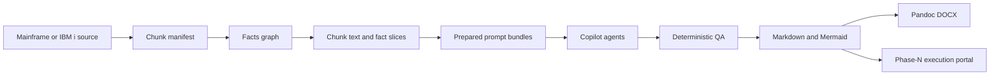

# Architecture

The pipeline separates deterministic extraction from constrained LLM authoring. Every model call
receives a prepared bundle rather than unrestricted access to the source tree.

## Ownership boundaries

| Area | Owner | Responsibility |
|------|-------|----------------|
| `config/` | Pipeline contract | Source discovery, DAG, grouping, glossary, templates |
| `scripts/phases/` | Executable phases | One independently runnable entry point per phase |
| `scripts/lib/` | Shared runtime | Inputs, retries, dispatch, grouping, DOCX, native helpers |
| `scripts/dispatchers/` | LLM fan-out | Copilot planning, concurrency, resume state, results |
| `.github/skills/` | Feature workflows | Deterministic preparation and domain rules |
| `.github/agents/` | LLM roles | Narrow authoring and review responsibilities |
| `docs/_shared/` | Machine artifacts | Manifests, facts, slices, bundles, diagrams, reviews |
| `docs/<lang>/` | Deliverables | Per-file and per-group human documentation |

## Determinism boundary

Phases A-C and deterministic portions of later phases are reproducible. LLM output can vary, so
this repository constrains it with:

- chunk-scoped facts instead of whole-workspace prompts;
- authoritative output paths in bundles;
- source-line citations;
- profile and template requirements;
- mechanical QA sidecars;
- resumable state and bounded retries.

## Platform contract

Phase A resolves `source_platform` as `mainframe` or `ibmi` and propagates it through manifests,
facts, bundles, agents, diagrams, and generated documents.

- Mainframe control flow uses JCL, DDNAMEs, datasets, CICS, and DB2 for z/OS terminology.
- IBM i uses ILE programs, libraries/objects/members, DB2 for i, and Control Language.
- CL and JCL remain distinct source kinds and evidence models.
