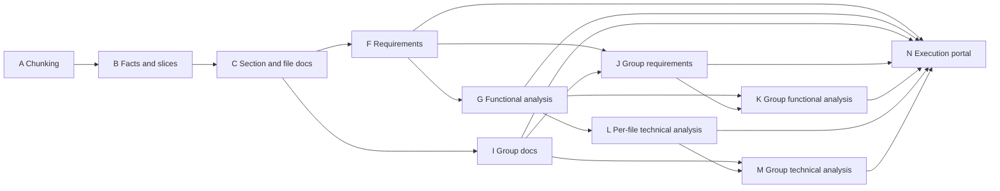

# DAG and execution model

The repository exposes two compatible phase views.

1. `config/pipeline-dag.yaml` is the declarative agent and artifact contract.
2. `scripts/run-pipeline.ps1` and `scripts/run-pipeline.sh` expose executable phases A-N.

The declarative DAG collapses executable documentation steps D, E, and H into node C. Validation
scripts reconcile the two views and fail when their ordering or script paths drift.

## Declarative DAG



## Runner mapping

| DAG node | Executable phases | Meaning |
|----------|-------------------|---------|
| A | A | Chunk each source |
| B | B, C | Extract facts, incoming xrefs, raw chunks, and fact slices |
| C | D, E, H | Author sections, finalize per-file docs, and author diagrams |
| F | F | Technical requirements |
| G | G | Functional analysis |
| I-K | I-K | Group-level documentation |
| L-M | L-M | Per-file and group technical analysis |
| N | N | Build the generated-documentation execution portal |

## Execution waves

`config/sources.yaml` selects an execution mode.

### `per-file-loop`

The default mode runs file-scoped work end to end for each source. Up to
`pipeline.per_file_parallelism` files can run concurrently. Workspace work waits for all file
loops to join.

The incoming-xref pass is declared in phase B but has workspace scope, so it is deferred until all
per-file facts exist.

### `per-phase`

The legacy mode runs each phase across all files before moving to the next phase. Use it for
debugging and reproducibility comparisons.

## Validation gates

```console
python scripts/validation/check-dag-integrity.py
python scripts/validation/check-phase-order.py
python scripts/validation/check-pipeline-dag-paths.py
```
