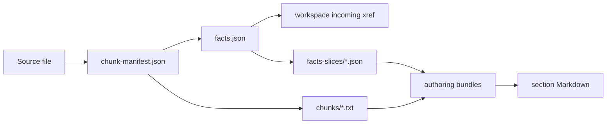

# Inspect generated artifacts

Do not treat a successful exit code as the only extraction check. Review the deterministic
artifacts after phases A-C, before model-backed authoring turns them into narrative documents.

## Artifact progression



Each downstream artifact records hashes or paths from its inputs. When a source changes, restart
at phase A instead of editing generated JSON or text by hand.

## Inspect the chunk manifest

`chunk-manifest.json` is the structural outline created by phase A. Its top-level contract looks
like this for the bundled mainframe program:

```json
{
  "manifest_version": "1.0",
  "source_path": "COBOL/ORDR100.CBL",
  "source_kind": "cobol",
  "source_platform": "mainframe",
  "encoding_detected": "utf-8",
  "sha256": "...",
  "line_count": 137,
  "chunks": [
    {
      "id": "ORDR100/procedure-division/MAIN-SECTION",
      "kind": "paragraph",
      "name": "MAIN-SECTION",
      "start_line": 53,
      "end_line": 76,
      "parent_id": "ORDR100/procedure-division"
    }
  ],
  "errors": []
}
```

Check these fields first:

| Field | Healthy value | Investigate when |
|-------|---------------|------------------|
| `source_platform` | `mainframe` or `ibmi` as intended | IBM i members are classified as mainframe |
| `source_kind` | `cobol`, `cl`, `jcl`, `proc`, `copybook`, or `bms` | CL is shown as JCL or a copybook as COBOL |
| `encoding_detected` | Matches the source encoding | Identifiers contain replacement characters |
| `chunks[]` | Divisions, paragraphs, records, steps, or commands are present | Only a file-level chunk exists |
| `errors[]` | Empty | Parsing diagnostics are present |

Equivalent Python inspection logic:

```python
import json

path = "docs/_shared/ORDR100.CBL/chunk-manifest.json"
with open(path, encoding="utf-8") as stream:
  manifest = json.load(stream)

print(
  manifest["source_platform"],
  manifest["source_kind"],
  len(manifest["chunks"]),
  manifest["errors"],
)
```

## Inspect the facts graph

`facts.json` is the phase-B knowledge graph. Collections are source-kind dependent:

| Collection | Examples |
|------------|----------|
| `paragraphs`, `performs`, `go_tos` | COBOL control flow |
| `calls`, `incoming_xref` | Calls between programs and reverse callers |
| `copybooks` | `COPY` dependencies |
| `exec_sql`, `exec_cics` | Embedded SQL and CICS operations |
| `data_records` | Level-01 records and child fields |
| `cl_commands` | IBM i `CALL`, `CALLPRC`, `SBMJOB`, `OVRDBF`, and `MONMSG` |
| `jcl_steps` | Mainframe job steps and invoked programs |

Print the most useful counts without platform-specific shell tools:

```python
import json

path = "docs/_shared/ORDR100.CBL/facts.json"
with open(path, encoding="utf-8") as stream:
  facts = json.load(stream)

collections = [
  "paragraphs",
  "performs",
  "calls",
  "copybooks",
  "exec_sql",
  "exec_cics",
  "data_records",
  "incoming_xref",
]
print({name: len(facts.get(name, [])) for name in collections})
```

For `ORDR100.CBL`, expect paragraphs, performs, one copybook reference, and data records. Empty
SQL, CICS, and external-call collections are valid because the sample does not use those features.

## Verify incoming cross-references

Incoming references are workspace facts. They are complete only when all potential callers are
processed in the same phase-B workspace pass. This matters for JCL-to-program, CL-to-program, and
COBOL-to-COBOL edges.

After running the IBM i manifest, print incoming callers for `ORDRUPD`:

```python
import json

path = "docs/_shared/ORDRUPD.SQLCBLLE/facts.json"
with open(path, encoding="utf-8") as stream:
  facts = json.load(stream)

print(json.dumps(facts.get("incoming_xref", []), indent=2))
```

If an expected caller is absent:

1. Confirm both caller and target were selected in the same run.
2. Check the target program ID in its facts file.
3. Check the caller's outbound `calls` or `cl_commands` collection.
4. Rerun phase B for the complete workspace.

## Inspect chunk text and fact slices

Phase C creates raw source text and chunk-scoped fact projections:

```text
docs/_shared/<file>/chunks/<chunk-id>.txt
docs/_shared/<file>/facts-slices/<chunk-id>.json
```

For a representative paragraph, verify that:

- text starts and ends on the manifest's recorded source lines;
- the fact slice contains only facts relevant to that chunk;
- calls and data references needed to explain the paragraph remain present;
- no neighboring paragraph source was accidentally included.

`chunks/index.json` maps chunk IDs to their raw text files and hashes. Use it instead of guessing
filename normalization rules.

## Inspect prepared bundles

Dry-run phase D before the first authored run:

```powershell
pwsh -NoProfile -File scripts/run-pipeline.ps1 `
  -Phases D `
  -Files repos/sample/COBOL/ORDR100.CBL `
  -SourceRoot repos/sample `
  -CopilotDocsDryRun
```

Bundles under `docs/_shared/<file>/_bundles/` should contain or identify:

- exactly one chunk's source text;
- the matching fact slice;
- source platform and source kind;
- the selected template and profile;
- output language requirements;
- authoritative Markdown and Mermaid output paths.

The JSON bundle is authoritative. Its Markdown sibling is a rendered view optimized for model
consumption and review.

## Inspect authored outputs and QA

Phase D writes section documentation and review findings. Later phases consolidate those sections.

```text
docs/<lang>/<file>/sections/*.md
docs/_reviews/section-doc/*.json
docs/_shared/<file>/diagrams/*.mmd
docs/<lang>/<file>/index.md
docs/<lang>/<file>/complete.md
```

Before accepting authored output, confirm:

1. Source claims have citations.
2. Program, paragraph, file, and field identifiers use the required styling.
3. Calls and called-by relationships match `facts.json`.
4. QA sidecars contain no blocking findings.
5. Mermaid sources refer only to facts present in the bundle.

## Machine-readable phase results

`-ResultsDir` controls XML result files produced by phase wrappers. A CI job should check the
process exit code and retain the XML, dispatch state, and logs as diagnostic artifacts.

```text
temp/<run>/chunk_results.xml
temp/<run>/facts_results.xml
temp/<run>/chunk_text_results.xml
logs/
```

The exact filenames vary by phase. Do not infer overall success from the presence of a file; use
the process exit code and the per-source success/failure records inside the result.

## Generated portal versus this site

Phase N publishes generated program documentation to `docs/_portal/site` and an offline edition
to `docs/_portal/site-offline`. This tracked guide is built from `site-docs/` by GitHub Pages.
Neither site should consume `docs.zip`.