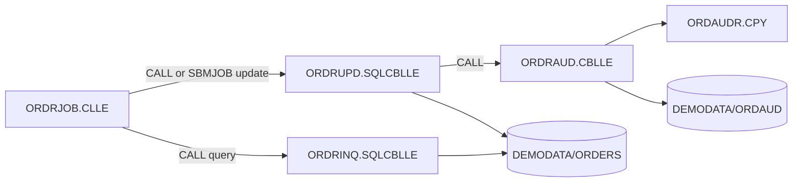

# IBM i sample repository

The tracked `repos/sample-as400/` repository is a compact IBM i (AS400) example for validating
the pipeline without customer source code. All programs, schema objects, and data are original and
vendor-neutral.

## Flow



The sample exercises:

- IBM i Control Language commands including `OVRDBF`, `CALL`, `SBMJOB`, and `MONMSG`;
- library-qualified program targets;
- ILE COBOL `PROCEDURE DIVISION USING` linkage;
- embedded DB2 for i `SELECT`, `UPDATE`, `COMMIT`, and `ROLLBACK` statements;
- a COBOL-to-COBOL audit call;
- a shared copybook exported from `QCPYSRC`.

## Run phases A-C

=== "Windows PowerShell"

    ```powershell
    pwsh -NoProfile -File scripts/run-pipeline.ps1 `
      -From A -To C `
      -Manifest repos/sample-as400/sources.json `
      -SourceRoot repos/sample-as400 `
      -ResultsDir temp/as400-sample
    ```

=== "Linux or macOS"

    ```bash
    bash scripts/run-pipeline.sh \
      -From A -To C \
      -Manifest repos/sample-as400/sources.json \
      -SourceRoot repos/sample-as400 \
      -ResultsDir temp/as400-sample
    ```

The manifest contains exactly five source members and excludes the sample's README, license, SQL
setup script, and CSV seed data.

## Expected relationships

| Caller | Target | Evidence |
|--------|--------|----------|
| `ORDRJOB` | `DEMOLIB/ORDRINQ` | CL `CALL` |
| `ORDRJOB` | `DEMOLIB/ORDRUPD` | CL `CALL` and nested `SBMJOB` command |
| `ORDRUPD` | `ORDRAUD` | COBOL `CALL` |
| `ORDRAUD` | `ORDAUDR` | COBOL `COPY` |

The incoming-xref workspace pass normalizes the library-qualified CL targets to the matching
program IDs when all sample members are processed together.

## Inspect IBM i facts

After the A-C run, start with the CL controller facts:

```python
import json

path = "docs/_shared/ORDRJOB.CLLE/facts.json"
with open(path, encoding="utf-8") as stream:
  facts = json.load(stream)

print(json.dumps(facts.get("cl_commands", []), indent=2))
```

Expected command families include `OVRDBF`, `CALL`, `SBMJOB`, and `MONMSG`. Targets may retain
library-qualified evidence such as `DEMOLIB/ORDRUPD`, while cross-reference resolution links that
evidence to the matching program ID.

Check the ILE COBOL update program for SQL and outbound calls:

```python
import json

path = "docs/_shared/ORDRUPD.SQLCBLLE/facts.json"
with open(path, encoding="utf-8") as stream:
  facts = json.load(stream)

print("SQL statements:", len(facts.get("exec_sql", [])))
print("Outbound calls:", facts.get("calls", []))
print("Incoming calls:", facts.get("incoming_xref", []))
```

Use [Inspect generated artifacts](artifacts.md) for the complete review sequence.

## Generate sample documentation

Once Copilot CLI authentication is available, the manifest can drive all per-file documentation.
Skip group phases until a sample group is declared, and skip the portal during the first authored
run:

=== "Windows PowerShell"

    ```powershell
    pwsh -NoProfile -File scripts/run-pipeline.ps1 `
      -Manifest repos/sample-as400/sources.json `
      -SourceRoot repos/sample-as400 `
      -Skip I,J,K,M,N `
      -SectionFinalizerLanguages en `
      -RequirementsLanguages en `
      -FunctionalAnalysisLanguages en `
      -TechnicalAnalysisLanguages en `
      -SkipDocx `
      -TechnicalAnalysisSkipDocx
    ```

=== "Linux or macOS"

    ```bash
    bash scripts/run-pipeline.sh \
      -Manifest repos/sample-as400/sources.json \
      -SourceRoot repos/sample-as400 \
      -Skip I,J,K,M,N \
      -SectionFinalizerLanguages en \
      -RequirementsLanguages en \
      -FunctionalAnalysisLanguages en \
      -TechnicalAnalysisLanguages en \
      -SkipDocx \
      -TechnicalAnalysisSkipDocx
    ```

CL files participate in section documentation, finalization, diagrams, and grouping. Requirement,
functional-analysis, and technical-analysis profiles primarily target COBOL program behavior.